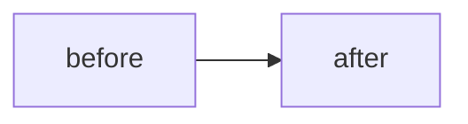

# <Title>

**TL;DR** — 2-3 lines: the problem, what I tried, the fix. Reader decides in 10 seconds whether to keep reading.

---

## Context

What I was doing, what stack, what architecture. Minimum needed for the problem to make sense without having worked with me.

---

## Attempt 1: <what you tried first>

What I thought, what I did, what happened. Include a real snippet/log if it helps.

**Result**: why it failed.

---

## Attempt 2: <next hypothesis>

(Optional — only if there were several attempts. The best war stories have 2-3 failed attempts before the solution.)

---

## The aha moment

The insight that changed how I thought about the problem. This is what separates a war story from a post-mortem.

---

## The solution

Concrete snippet of what stayed. What actually worked.

---

## Diagram (optional)

---

## Takeaways

1. Generalizable lesson, not specific.
2. Something I did not think about initially.
3. A reusable pattern.
4. (Max 5. More than 5 is filler.)

---

## Stack involved

- Tech + version if it matters
- External tools

---

## Links / references

- [Relevant official doc](https://...)
- [Issue / PR / SO that helped](https://...)
