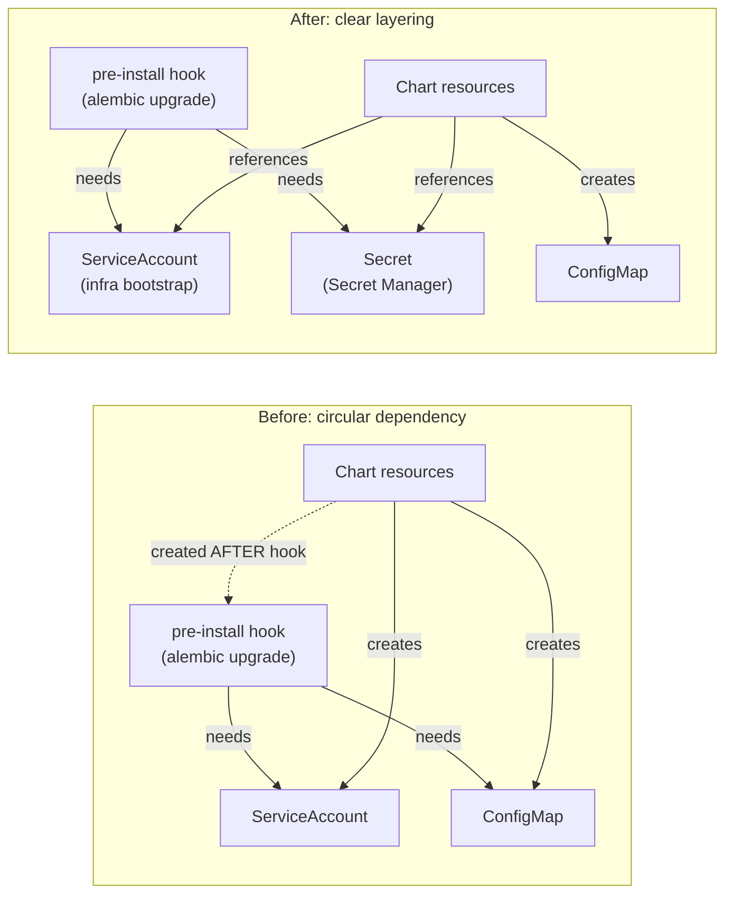

# The catch-22 of Helm pre-install hooks

**TL;DR** — We were deploying an app with automatic DB migration using a Helm `pre-install` hook. The hook depended on resources the chart would create later. And when the deploy failed with `--atomic`, the rollback deleted the resources we had pre-created. Three failed attempts, a textbook catch-22, and a lesson about where resources live in a Helm + GKE + Workload Identity architecture.

---

## Context

We were deploying a FastAPI app to GKE using a Helm chart with this design:

- **Pre-install hook**: runs `alembic upgrade head` to migrate the DB before new pods come up
- **Regular chart resources**: Deployment, Service, ConfigMap, ServiceAccount, Secret

On a private GKE cluster with Cloud SQL, the migration hook needs:

- **Cloud SQL Auth Proxy** as init container (to connect to the private DB)
- **K8s ServiceAccount** with Workload Identity annotation (so the proxy authenticates to GCP without service account keys)
- **K8s Secret** with `DATABASE_URL`
- **K8s ConfigMap** with app environment variables

The critical detail, which we were about to learn the hard way: **`pre-install` hooks run before the chart's regular resources.**

---

## Attempt 1: trust the chart

The obvious thing: let the chart create the ServiceAccount and assume Helm will create it before the hook.

```yaml
# values.yaml
backend:
  serviceAccount:
    create: true
    name: "rag-enterprise-ai-platform"
    annotations:
      iam.gke.io/gcp-service-account: "backend-wi@project.iam.gserviceaccount.com"
```

**Result**: the hook fails creating the migration pod:

```
Error creating: pods "db-migrate-" is forbidden:
error looking up service account enterprise-ai/rag-enterprise-ai-platform:
serviceaccount "rag-enterprise-ai-platform" not found
```

Of course: it's a `pre-install` hook. The chart's regular resources haven't been created yet. The chart wants to create the SA **after** the hook finishes.

**Catch-22 version 1**: the hook needs a resource that the chart will create after the hook.

---

## Attempt 2: pre-create the SA manually

If the chart can't create it in time, I pre-create it externally before `helm install`:

```bash
kubectl create serviceaccount rag-enterprise-ai-platform -n enterprise-ai
kubectl annotate serviceaccount rag-enterprise-ai-platform \
  -n enterprise-ai \
  "iam.gke.io/gcp-service-account=backend-wi@project.iam.gserviceaccount.com"
```

**Result of the first run**: the hook starts, Cloud SQL Proxy connects, `alembic` begins migrating. But it fails for another reason: the hook also uses `envFrom: configMapRef` to load 20+ variables, and the ConfigMap **doesn't exist yet either** (same problem, different resource).

`helm upgrade --install --atomic` triggers an automatic rollback.

**Result of the second run**:

```
Error: Unable to continue with install:
ServiceAccount "rag-enterprise-ai-platform" in namespace "enterprise-ai"
exists and cannot be imported into the current release:
invalid ownership metadata;
annotation validation error: missing key "meta.helm.sh/release-name"
```

Helm finds a SA with the expected name but without the labels/annotations that mark it as part of the release. It refuses to "adopt" it — this is a safety mechanism to prevent Helm from taking control of resources belonging to another release.

---

## Attempt 3: pre-create the SA with Helm ownership metadata

I add the labels and annotations Helm validates:

```yaml
apiVersion: v1
kind: ServiceAccount
metadata:
  name: rag-enterprise-ai-platform
  namespace: enterprise-ai
  labels:
    app.kubernetes.io/managed-by: Helm
  annotations:
    meta.helm.sh/release-name: enterprise-ai
    meta.helm.sh/release-namespace: enterprise-ai
    iam.gke.io/gcp-service-account: "backend-wi@project.iam.gserviceaccount.com"
```

**Result of the first run**: Helm adopts the SA. Deploy progresses. Fails for something else (we still haven't solved the ConfigMap issue). Atomic rollback.

**Result of the second run**:

```
Error creating: pods "db-migrate-" is forbidden:
serviceaccount "rag-enterprise-ai-platform" not found
```

Again. But this time because the rollback deleted it.

Here is the **catch-22 version 2**: Helm considers the SA part of the release (because of the ownership metadata I gave it) and deletes it on atomic rollback.

- **Without ownership metadata** → Helm rejects the install (invalid ownership)
- **With ownership metadata** → Helm deletes it on rollback

There is no middle ground.

---

## The aha moment

The error was in the mental model. I was treating the SA as "something from the chart that I pre-create for convenience". But the SA had an annotation tying it to a specific GCP Service Account:

```
iam.gke.io/gcp-service-account: "backend-wi@project.iam.gserviceaccount.com"
```

That is not application configuration. It is **infrastructure**.

Compare it with Secrets. Nobody expects a Helm chart to generate the actual DB passwords. Passwords come from a vault (Secret Manager, Vault, Sealed Secrets) and the chart references them with `secrets.create: false`. It is a universal pattern.

A ServiceAccount with a WI annotation is **exactly the same**. It is the link between a K8s resource and a GCP IAM resource. It lives in the infrastructure layer, not the application layer. It should not live inside the Helm release.

---

## The solution

Two changes, both small, both non-obvious:

### 1. SA external to the chart

```yaml
# values.yaml
backend:
  serviceAccount:
    create: false              # SA is created by infra bootstrap
    name: "rag-enterprise-ai-platform"
```

The SA is created once per environment, as part of the same bootstrap script that creates the Secrets from Secret Manager:

```bash
# bootstrap.sh (runs once per environment)
kubectl create serviceaccount "$SERVICE_ACCOUNT" \
  -n "$NAMESPACE" --dry-run=client -o yaml | kubectl apply -f -

kubectl annotate serviceaccount "$SERVICE_ACCOUNT" \
  -n "$NAMESPACE" \
  "iam.gke.io/gcp-service-account=${WI_SA_EMAIL}" \
  --overwrite
```

No `meta.helm.sh/*` annotations. The SA is an infrastructure resource; Helm never touches it.

### 2. Remove the ConfigMap dependency from the hook

The hook originally loaded the entire ConfigMap:

```yaml
# db-migrate-hook.yaml (before)
containers:
  - name: db-migrate
    envFrom:
      - configMapRef:
          name: enterprise-ai-config   # <- does not exist yet
    env:
      - name: DATABASE_URL
        valueFrom:
          secretKeyRef: { name: enterprise-ai-secrets, key: database-url }
```

But `alembic upgrade head` does not need CORS, nor Gemini model names, nor feature flags. Only `DATABASE_URL`. I simplify it:

```yaml
# db-migrate-hook.yaml (after)
containers:
  - name: db-migrate
    env:
      - name: DATABASE_URL
        valueFrom:
          secretKeyRef: { name: enterprise-ai-secrets, key: database-url }
```

Now the hook is self-contained: it only depends on the Secret (already external to the chart) and on the SA (now also external). No circular dependency.

---

## Diagram



---

## Takeaways

1. **`pre-install` hooks must be self-contained**. They can only depend on resources that exist **before** the release. If they depend on something the chart creates, it is a chart design bug.

2. **Find the right boundary between infra and app**. If a resource has annotations that bind it to external infra (Workload Identity, Cloud SQL, Secret Manager), it probably does not belong to the chart. Manage it outside.

3. **`--atomic` is all-or-nothing**. On rollback, Helm deletes everything that has release ownership metadata. This is correct. The mistake is considering part of the release something that should not be.

4. **The Secrets pattern already exists — copy it**. Just as no one puts passwords in values.yaml, you should not put Workload Identity bindings there either. If you already use `secrets.create: false`, you probably also need `serviceAccount.create: false`.

5. **Hooks should do the minimum**. A DB migration job does not need 20 environment variables. Only the minimum to connect to the DB. Every unnecessary dependency is a failure point that runs before the rest of the release.

---

## Stack involved

- GKE (private cluster) with Workload Identity
- Helm 3 (OCI chart)
- Cloud SQL PostgreSQL + Cloud SQL Auth Proxy sidecar
- Alembic for migrations
- GitHub Actions as CD with `helm upgrade --install --atomic`
- Workload Identity Federation for the pipeline (no service account keys)

---

## Links / references

- [Helm Hooks docs](https://helm.sh/docs/topics/charts_hooks/)
- [Helm Resource Policies](https://helm.sh/docs/howto/charts_tips_and_tricks/#tell-helm-not-to-uninstall-a-resource)
- [GKE Workload Identity](https://cloud.google.com/kubernetes-engine/docs/how-to/workload-identity)
