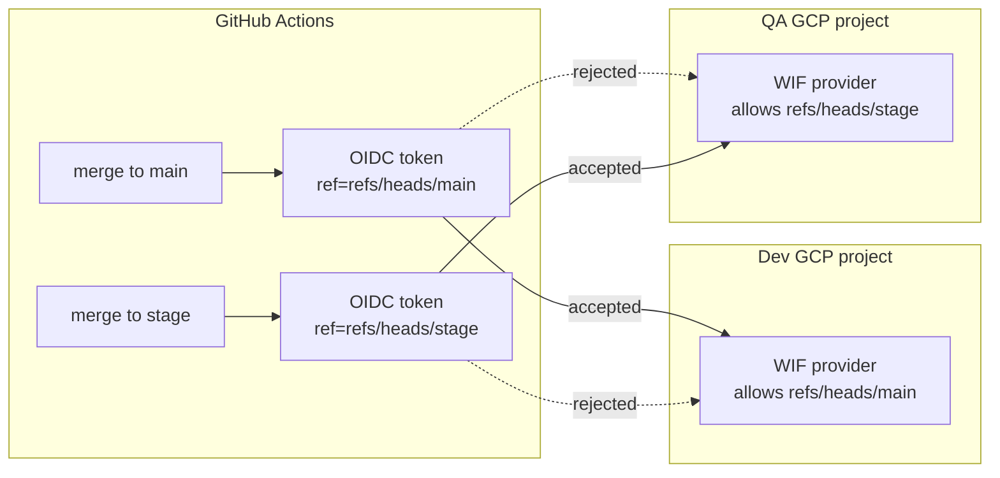

# Workload Identity Federation for multi-branch CD pipelines

**TL;DR** — One Terraform codebase produces one WIF provider per environment. The provider authorizes the GitHub Actions OIDC token, checking (among other things) the branch the workflow ran on. I had hardcoded `refs/heads/main`. When I added a second CD that deploys from `stage` to QA, every auth step failed. The fix was to parameterize the allowed ref per environment, keeping each WIF provider least-privilege for its own branch.

---

## Context

The architecture:

- One repo (`enterprise-ai-platform`) with two CD workflows:
  - `cd.yml` — merges to `main` → deploy to the dev GCP project
  - `cd-qa.yml` — merges to `stage` → deploy to the QA GCP project
- Each environment has its own GCP project, its own WIF pool, and its own WIF provider. This is by design: a pool compromise in dev cannot be used to reach QA.
- The Terraform code is shared across environments — same modules, different `tfvars`.

The WIF provider uses `attribute_condition` to reject any OIDC token that does not match the repository, owner, and branch. This is standard hardening so that forks or unrelated workflows cannot assume the service account.

---

## Attempt 1: hardcode the branch and hope both CDs use main

The initial WIF provider:

```hcl
attribute_condition = join(" && ", [
  "assertion.repository == 'data-oilers/enterprise-ai-platform'",
  "assertion.repository_owner == 'data-oilers'",
  "assertion.ref == 'refs/heads/main'",
])
```

The dev CD triggers on merges to `main`, so the token brings `ref=refs/heads/main` and the check passes.

**Result for the QA CD**: every auth step fails at `google-github-actions/auth@v2` with a generic error. The QA CD triggers from `stage`, so the token brings `ref=refs/heads/stage`. The provider in the QA project rejects it.

The log line in GitHub Actions does not say "ref mismatch". It says something like "failed to generate credentials". The real reason lives in the WIF provider audit log on the GCP side, which is several clicks away.

---

## Attempt 2 (considered): remove the branch restriction

"If I drop the `assertion.ref` check, both CDs will pass." Quick fix, but:

- Any workflow in the repo — including one a contributor might add on a topic branch — could now assume the service account.
- In a repo that deploys to a bank's GCP project, giving up the branch restriction is not a tradeoff I want to make.

Rejected.

---

## Attempt 3 (considered): OR the branches together

```hcl
"assertion.ref == 'refs/heads/main' || assertion.ref == 'refs/heads/stage'"
```

This works, but now the dev project's WIF provider accepts `stage` and the QA project's provider accepts `main`. A misconfigured dev CD could deploy to QA (and vice-versa). The shared code produces a less-restrictive policy than each environment needs.

Rejected.

---

## The aha moment

The WIF providers should not share the same policy. Each environment has exactly one legitimate branch, and that branch is environment-specific. The right shape is **shared code, parameterized per environment** — the same pattern you already use for project IDs, regions, and CIDR ranges.

The WIF policy is just another environment-specific value. Treat it that way.

---

## The solution

A new variable in the Terraform module:

```hcl
# variables.tf
variable "wif_allowed_ref" {
  description = "Git ref allowed by the WIF attribute_condition (dev=refs/heads/main, qa=refs/heads/stage)"
  type        = string
  default     = "refs/heads/main"
}
```

Using it in the provider:

```hcl
# wif.tf
attribute_condition = join(" && ", [
  "assertion.repository == 'data-oilers/enterprise-ai-platform'",
  "assertion.repository_owner == 'data-oilers'",
  "assertion.ref == '${var.wif_allowed_ref}'",
])
```

Per-environment values:

```hcl
# envs/dev.tfvars
wif_allowed_ref = "refs/heads/main"

# envs/qa.tfvars
wif_allowed_ref = "refs/heads/stage"
```

Each provider authorizes exactly one branch. If someone accidentally points a dev CD at QA infrastructure, the auth fails.

---

## Diagram



---

## Takeaways

1. **Shared Terraform code is fine — shared policy is not**. Parameterize the things that must differ per environment, even if the resource shape is identical.

2. **WIF providers should be least-privilege per environment**. One provider, one branch, one scope.

3. **OIDC auth errors are generic on the GitHub side**. The real reason lives in GCP audit logs. If you have a choice, add a pre-auth step that logs the token claims (without logging the token itself) — it saves hours of guessing.

4. **The attribute condition is not the only lever**. The provider binding (`google_service_account_iam_member`) also accepts a `principalSet` filter. Combining both (`attribute_condition` + scoped principal) gives defense in depth.

5. **Never use `assertion.ref.startsWith("refs/heads/")`** or any wildcard on branches in the provider condition. A contributor opening a branch named `main-is-fake` would match. Pin to exact values.

---

## Stack involved

- Terraform (Google provider)
- GCP Workload Identity Federation
- GitHub Actions with `google-github-actions/auth@v2`
- OIDC tokens from `token.actions.githubusercontent.com`

---

## Links / references

- [GitHub OIDC token claims reference](https://docs.github.com/en/actions/deployment/security-hardening-your-deployments/about-security-hardening-with-openid-connect#understanding-the-oidc-token)
- [Google Cloud WIF attribute conditions](https://cloud.google.com/iam/docs/workload-identity-federation#conditions)
- [google-github-actions/auth](https://github.com/google-github-actions/auth)
