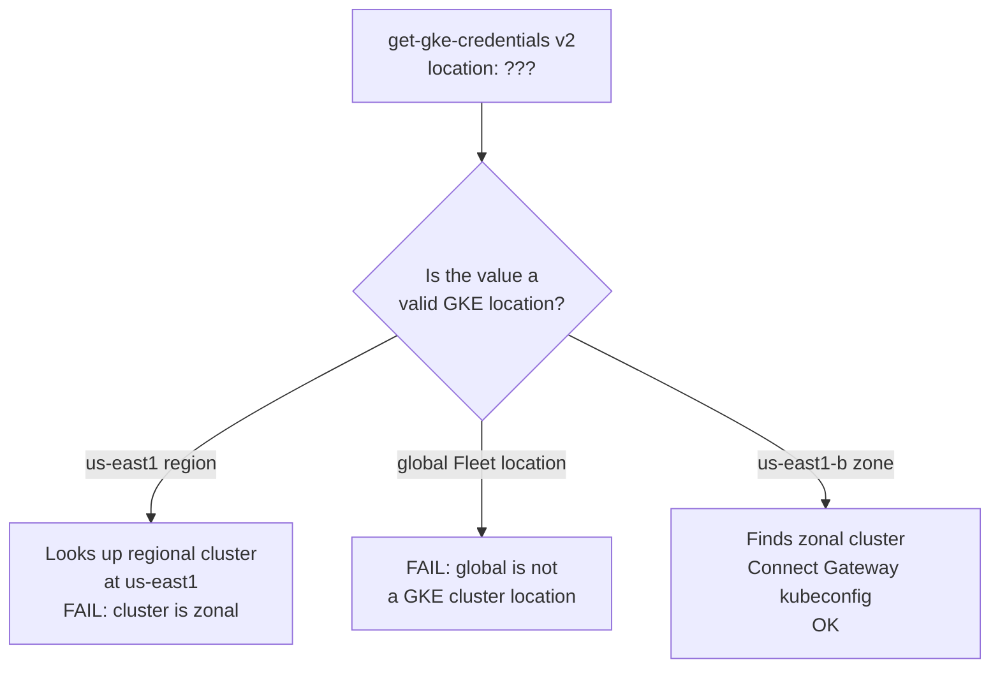

# The GKE_REGION secret that is actually a zone

**TL;DR** — A CD pipeline step authenticates to a private GKE cluster through Connect Gateway. The step takes a `location` parameter. I cycled through three values before finding the right one: the region, `global`, and finally the zone. The parameter is always the cluster's location, never the Fleet membership location — regardless of whether Connect Gateway is enabled.

---

## Context

The new QA CD pipeline needed to reach a private GKE cluster to run `helm upgrade`. Private GKE means no public control plane endpoint, so the standard approach is [Connect Gateway](https://cloud.google.com/anthos/multicluster-management/gateway): a Google-managed proxy that routes authenticated requests from outside the VPC to the private API server.

The pipeline step:

```yaml
- name: Get GKE credentials (via Connect Gateway)
  uses: google-github-actions/get-gke-credentials@v2
  with:
    cluster_name: ${{ secrets.GKE_CLUSTER_QA }}
    location: ${{ secrets.GKE_REGION_QA }}
    use_connect_gateway: true
```

The dev pipeline had been working with this shape for months, using `secrets.GKE_REGION`. I added `GKE_REGION_QA` and copied the pattern. What could go wrong.

---

## Attempt 1: `GKE_REGION_QA = us-east1`

The cluster lives in the `us-east1` region. That is what "region" means, right?

**Error**:

```
not found: projects/itmind-macro-ai-qa-0/locations/***/clusters/***
```

GitHub masks the secret values with `***`, so the log looks uninformative. But the path format `projects/PROJECT/locations/LOCATION/clusters/CLUSTER` is the standard GKE API resource path. The action was trying to find a **regional** cluster at `us-east1` and not finding it.

Why? The cluster is **zonal** (`us-east1-b`), not regional. At `us-east1` there is nothing.

---

## Attempt 2: `GKE_REGION_QA = global`

"Wait — with Connect Gateway, the location should be where the Fleet membership is registered. Fleet memberships live in `global` by default." Let me verify:

```bash
$ gcloud container fleet memberships describe macro-ai-qa-gke \
    --project=itmind-macro-ai-qa-0 --format='value(name)'
projects/itmind-macro-ai-qa-0/locations/global/memberships/macro-ai-qa-gke
```

Confirmed: `locations/global`. So I switch the secret to `global`.

**Error**:

```
location "***" does not exist
```

Different error this time. `global` is a valid Fleet location but **not a valid GKE cluster location**. The action is still looking up the cluster, not the membership.

---

## Attempt 3: `GKE_REGION_QA = us-east1-b`

The actual zone of the cluster. Works. Deploy proceeds.

---

## The aha moment

I had been assuming `use_connect_gateway: true` changed how the `location` parameter is interpreted. It does not.

`get-gke-credentials@v2` always resolves the cluster using the GKE Resource Manager API path: `projects/{project}/locations/{location}/clusters/{cluster}`. For a zonal cluster, `{location}` is the zone. For a regional cluster, it is the region. The Fleet membership location is irrelevant to this step.

What `use_connect_gateway: true` actually does is change **how the kubeconfig is generated** — specifically, it sets the API server address to the Connect Gateway endpoint instead of the cluster's (private) IP. That is all.

So two different lookups, two different concepts of "location":

- **Cluster location**: the zone or region where the nodes live. Used by the GKE API and by `get-gke-credentials`.
- **Membership location**: where the Fleet registration is stored. Usually `global`. Used by Fleet APIs like `gcloud container fleet memberships get-credentials`.

They look similar but are not the same thing, and mixing them up produces confusing errors.

---

## The solution

```
GKE_REGION_QA = us-east1-b
```

The secret name is misleading. `GKE_REGION_QA` stores a zone. Renaming the secret to `GKE_LOCATION_QA` would be clearer, but the pattern already existed in the dev CD and refactoring both at once was out of scope.

If you are setting this up fresh, use `GKE_LOCATION` as the secret name. It is correct for both zonal clusters (where it holds a zone) and regional clusters (where it holds a region), and it is correct regardless of whether Connect Gateway is used.

---

## Diagram



---

## Takeaways

1. **Parameter names mislead**. `location` in a pre-`Connect Gateway` world meant one thing. With Connect Gateway added, the natural assumption is that it now means Fleet membership location. It does not. Read the action source if the docs are ambiguous.

2. **GitHub Actions masks secret values in error messages**. When debugging, the real value in the URL is replaced by `***`. To see what you actually sent, log the value in a debug step (carefully — never log the value of an actual secret).

3. **Two kinds of location on GKE with Fleet**: cluster (zone/region) and membership (usually global). Most APIs use one; a few use the other. Always check which one the tool you are using expects.

4. **Rename the secret**. `GKE_LOCATION` is the right name; `GKE_REGION` is wrong whenever the cluster is zonal. I did not fix it because the pattern predated me, but I would in a greenfield setup.

---

## Stack involved

- `google-github-actions/get-gke-credentials@v2`
- GKE private cluster (zonal, `us-east1-b`)
- GKE Fleet / Connect Gateway
- GitHub Actions secrets

---

## Links / references

- [get-gke-credentials action docs](https://github.com/google-github-actions/get-gke-credentials)
- [Connect Gateway overview](https://cloud.google.com/anthos/multicluster-management/gateway)
- [GKE resource paths](https://cloud.google.com/kubernetes-engine/docs/concepts/cluster-architecture#resource_paths)
