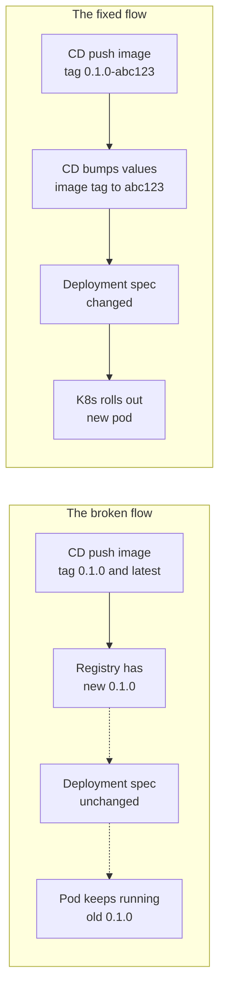

# Silent Airflow rollout — the pod ran the old image for 16 days

**TL;DR** — The data team reported a DAG failing with `ModuleNotFoundError` for a module that clearly existed on `main`. The CD pipeline had been pushing new Airflow images for weeks. But the scheduler pod had `RESTARTS: 0` and `AGE: 16d`. It was running the image it pulled on day one. Pushing an image to a registry is not a rollout — a pod spec has to change for Kubernetes to act.

---

## Context

- Apache Airflow 3 deployed on GKE via the official Helm chart.
- A custom Airflow image that bundles internal Python modules (`src.infrastructure.rag.*`) so DAGs can import them.
- A CD pipeline that, on every merge to `main`, rebuilds the custom image and pushes it to Artifact Registry with three tags: the git SHA, the semver, and `latest`.

The Helm values referenced the image with a pinned semver tag (e.g., `0.1.0`) that only changes on version bumps. For most of the iterations, the tag stayed the same — only the `:latest` alias moved.

---

## The symptom

```
Broken DAG: [/opt/airflow/dags/indexing/rag_indexing.py] 
Traceback (most recent call last):
  File "...", line 12, in <module>
    from src.infrastructure.rag.chunking.contextualizer import contextualize_chunks
ModuleNotFoundError: No module named 'src.infrastructure.rag.chunking.contextualizer'
```

The module existed in the repo. The CD had just built and pushed an image containing it. And yet.

---

## The diagnosis

```
$ kubectl get pods -n airflow airflow-scheduler-5c48dbd746-s8tqh
NAME                                 READY   STATUS    RESTARTS   AGE
airflow-scheduler-5c48dbd746-s8tqh   4/4     Running   0          16d
```

`AGE: 16d` with `RESTARTS: 0`. The pod was born on 2026-03-31 and never restarted. Whatever image it pulled at birth is what it has been running for 16 days.

```
$ kubectl get pod airflow-scheduler-5c48dbd746-s8tqh -n airflow \
    -o jsonpath='{.spec.containers[*].image}'
us-east1-docker.pkg.dev/.../airflow-custom:0.1.0
```

The image tag is `0.1.0`. The Deployment has always referenced `0.1.0`. The CD has been pushing new images *also tagged* `0.1.0` (plus `:latest`, plus a SHA).

From Kubernetes' point of view: the pod spec has not changed. The `image:` field in the Deployment manifest is the same string it has always been. There is nothing to roll out.

And with the default `imagePullPolicy: IfNotPresent`: the node already has `0.1.0` cached from day one, so even if Kubernetes did replace the pod, it would not re-pull the image.

---

## The immediate fix

```bash
kubectl rollout restart deployment/airflow-scheduler -n airflow
kubectl rollout restart deployment/airflow-dag-processor -n airflow
kubectl rollout restart statefulset/airflow-worker -n airflow
```

`rollout restart` bumps a `kubectl.kubernetes.io/restartedAt` annotation on the pod template. That annotation is a spec change — tiny, but enough. Kubernetes rolls out new pods. The nodes pull the latest `0.1.0` (which is now actually the new one), and the code is current.

---

## The trap: stateful worker with a 10-minute grace period

The Airflow worker is a StatefulSet with `terminationGracePeriodSeconds: 600`. On `rollout restart`, the old worker refuses to die immediately because it is waiting for its Celery tasks to finish. If there are long-running tasks, the restart hangs for up to 10 minutes.

When you cannot wait:

```bash
kubectl delete pod airflow-worker-0 --force --grace-period=0
```

But this kills in-flight tasks. Whether that is acceptable depends on the task. For an indexing pipeline that is idempotent, fine. For anything that writes external state without transactions, not fine.

---

## The aha moment

A pod with **zero restarts in 16 days** on a platform with active CI/CD is not a sign of stability. It is a red flag. Either no one is deploying, or deploys are not reaching this workload. In this case, the second was true.

In a mature CI/CD setup, every successful deploy should produce a visible pod churn event. If days go by with no restarts, something is silently wrong — either the pipeline is not running, or it is running but its output is not affecting the cluster.

---

## The permanent fix (options)

Three viable approaches, with tradeoffs:

| Option | How | Tradeoff |
|--------|-----|----------|
| **Pin tag to SHA** | CD rewrites `values.yaml` with the commit SHA before `helm upgrade`. Each deploy changes the `image:` string. | Explicit, auditable, works with any `imagePullPolicy`. Values file is modified per deploy — not great for GitOps. |
| **Rolling annotation** | Helm chart includes `checksum/build` annotation on the pod template, set from a build ID. Each deploy changes the annotation, forcing a rollout. | Clean in GitOps flow (values unchanged). Requires chart support. |
| **Post-deploy hook** | CD runs `kubectl rollout restart` after `helm upgrade`. | Simple. Couples the CD to cluster state. Fragile if the cluster is reached via Connect Gateway / behind auth. |

For this stack we moved toward option 1: let the CD bump a `backend.image.tag` value that the chart references. It gives us the cleanest audit trail — every release in Helm history has the exact image SHA it deployed.

---

## Diagram



---

## Takeaways

1. **Pushing an image is not a rollout**. Kubernetes only reconciles when the Deployment spec changes. Same tag = no spec change = no rollout.

2. **`imagePullPolicy: Always` does not save you** alone. It only matters if the pod is being recreated. If the spec does not change, the pod is not recreated, and `Always` is never consulted.

3. **Pin deployment tags to something that changes every build** (SHA, build ID, semver-with-metadata). `latest` is a lie in a production manifest.

4. **`RESTARTS: 0` with high `AGE` is a red flag** in a CI/CD environment. Add an alert for pods that have not rolled over in N days while deploys are happening.

5. **Stateful workers need graceful restart planning**. Airflow workers, databases, queues — anything with in-flight state cannot be force-killed without consequences. Know the `terminationGracePeriodSeconds` for each and budget for it in your deploy window.

---

## Stack involved

- Apache Airflow 3 (Helm chart)
- GKE private cluster
- Artifact Registry
- Celery workers with custom Python modules
- GitHub Actions CD

---

## Links / references

- [Kubernetes rollout restart](https://kubernetes.io/docs/reference/generated/kubectl/kubectl-commands#-em-restart-em-)
- [Helm checksum annotation pattern](https://helm.sh/docs/howto/charts_tips_and_tricks/#automatically-roll-deployments)
- [Airflow worker terminationGracePeriod discussion](https://airflow.apache.org/docs/helm-chart/stable/parameters-ref.html#workers)
