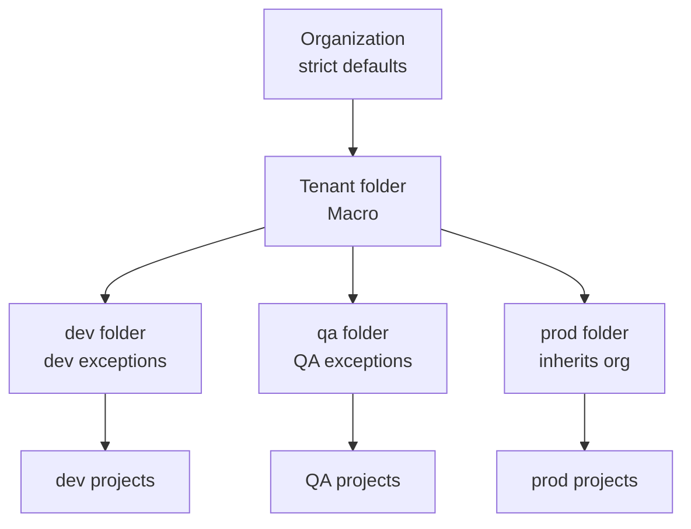

# Org policies blocking a new environment — overriding at the right layer

**TL;DR** — Bringing up a new QA environment, four org policies inherited from the org level blocked legitimate resource creation. My first instinct was to override them at the project level, but the project factory service account did not (and should not) have `orgpolicy.policyAdmin`. The right place was the QA folder, not the project — an insight about policy hierarchy that matters in every multi-env landing zone.

---

## Context

The landing zone is a [FAST](https://github.com/GoogleCloudPlatform/cloud-foundation-fabric) multi-tenant deployment with this folder hierarchy:

```
Organization
└── Tenants
    └── Macro (tenant folder)
        ├── dev   (folder)
        ├── qa    (folder)   ← bringing this one up
        └── prod  (folder)
```

Org-level policies enforce security defaults:

- No service account key creation
- Private Google Access required on subnets
- Cloud SQL root password enforced
- No external Workload Identity providers

All reasonable defaults for prod. Some of them blocked a legitimate QA setup.

---

## The four policies that blocked me

| Policy | Why it blocked QA |
|--------|-------------------|
| `cloudsqlRequireRootPassword` | Our Cloud SQL module stores credentials in Secret Manager, not inline in the create call. The policy rejected the create. |
| `networkRequireSubnetPrivateGoogleAccess` | Inherited default was stricter than what the subnet setup actually required; the check looked at a flag that was technically equivalent but different. |
| `disableServiceAccountApiKeyCreation` | A legacy monitoring API still needed a key during bootstrap. |
| `workloadIdentityPoolProviders` | The default allowlist did not include `token.actions.githubusercontent.com`. GitHub Actions WIF could not be created. |

Each one produced a distinct `terraform apply` error along the lines of:

```
Error: Error creating ...: googleapi: Error 400: Constraint constraints/sql.restrictAuthorizedNetworks
violated for PROJECT_ID with location us-east1. See
https://cloud.google.com/resource-manager/docs/organization-policy/...
```

---

## Attempt 1: override at the project level via the project factory

First instinct: since the resources live in the QA project, put the overrides on the QA project.

Two things went wrong.

**Problem 1: permission.** The project factory service account has a narrow role (`roles/resourcemanager.projectCreator`, a few others). It does not have `roles/orgpolicy.policyAdmin`. And it **should not have it** — granting the ability to change org policies to the SA that creates projects is a nasty privilege escalation. Any time you create a project, you could also silently drop security constraints on it.

Terraform failed immediately with `Permission 'orgpolicy.policyExceptions.create' denied`.

**Problem 2: blast radius.** Even if I solved the permission, overriding at project level would not scale. For a landing zone with 20 projects, you would have 20 copies of the same four overrides to maintain. Not maintainable.

---

## Attempt 2 (considered): grant the project factory SA `orgpolicy.policyAdmin`

This would have unblocked the apply. It would also have made the project factory a highly privileged principal capable of modifying org policy at any level under its authority.

In a bank's landing zone, this is a hard no. The whole point of the folder hierarchy is that only a small number of principals at `0-org-setup` can modify policy. Widening that surface is backward.

Rejected.

---

## The aha moment

Org policy exceptions have an implicit "blast radius" — every resource under the policy-owning scope is affected. The right scope for a dev-only exception is **the dev folder**, not every project in it. Same for QA.

In FAST, `0-org-setup` is the only stage that runs with a principal capable of modifying org policies. Folder-level overrides should live there.

```
Org                               ← most restrictive defaults
└── Tenants
    └── Macro
        ├── dev   (overrides)     ← dev-specific relaxations
        ├── qa    (overrides)     ← QA-specific relaxations
        └── prod  (no overrides)  ← inherits the strict org defaults
```

The exception lives exactly where it applies. Prod never gets it. Dev does not share it with QA unless you duplicate it.

---

## The solution

In `fast/0-org-setup/`, the folder module already supports inline org policies:

```hcl
module "folder-qa" {
  source = "../../../../fabric/modules/folder"
  parent = var.tenant_folder_id
  name   = "qa"

  org_policies = {
    "sql.restrictAuthorizedNetworks" = {
      rules = [{ enforce = false }]
    }
    "iam.disableServiceAccountApiKeyCreation" = {
      rules = [{ enforce = false }]
    }
    "compute.requireOsLogin" = {
      rules = [{ enforce = false }]
    }
    "iam.workloadIdentityPoolProviders" = {
      rules = [{
        allow = {
          values = ["https://token.actions.githubusercontent.com"]
        }
      }]
    }
  }
}
```

Applied with the `0-org-setup` stage SA, which has the right permissions. One location, affects every current and future project in the QA folder, does not touch dev or prod.

---

## Diagram



Each folder owns the set of exceptions that apply to its environment. Projects inherit from their folder; no project-level overrides.

---

## Takeaways

1. **Identify the correct scope for every exception**. Ask: "is this a dev-only relaxation, a tenant-specific exception, or an organization-wide choice?" The answer determines the layer.

2. **Never grant `orgpolicy.policyAdmin` to project-level principals**. Org policy management belongs at `0-org-setup`, run by a separate SA with separate blast radius.

3. **Each exception should be traceable to a comment explaining WHY**. Without the `why`, the next engineer either removes it (breaks things) or copies it to prod (weakens security).

4. **Policy enforcement errors name the policy explicitly**. `constraints/sql.restrictAuthorizedNetworks` tells you exactly which one fired. Use `gcloud resource-manager org-policies list --folder=FOLDER_ID` to see where it is enforced and where the inheritance started.

5. **Least privilege applies to IaC runners too**. The SA that creates projects should not be able to remove security constraints from them. Granting "just enough" to each Terraform stage is a design decision, not a limitation.

---

## Stack involved

- GCP Organization Policies
- Cloud Foundation Fabric / FAST framework
- Terraform `fabric/modules/folder` with `org_policies` input
- Multi-tenant landing zone folder hierarchy

---

## Links / references

- [GCP Organization Policies](https://cloud.google.com/resource-manager/docs/organization-policy/overview)
- [FAST / Cloud Foundation Fabric](https://github.com/GoogleCloudPlatform/cloud-foundation-fabric)
- [FAST folder module `org_policies` input](https://github.com/GoogleCloudPlatform/cloud-foundation-fabric/tree/master/modules/folder#organization-policies)
