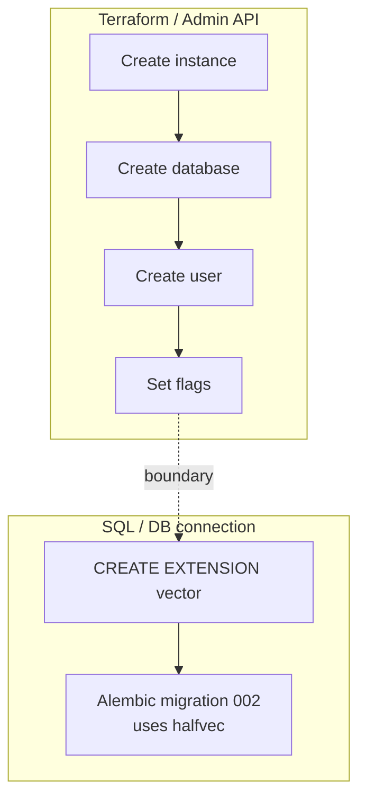

# Cloud SQL and pgvector — the extension Terraform cannot install

**TL;DR** — The CD pipeline provisions everything automatically except one SQL statement. The first deploy to a new environment fails inside the DB migration with `type "halfvec" does not exist`. The pgvector extension must exist before the schema can reference it, and Cloud SQL only lets you install extensions via a DB connection. Terraform cannot do it. You run `CREATE EXTENSION vector;` once per environment and move on.

---

## Context

The application uses pgvector 0.8+ with the `halfvec` type to store 768-dimensional embeddings produced by Gemini. The first Alembic migration (`001_initial_schema.py`) creates base tables. The second (`002_rag_domain.py`) adds the `embedding halfvec(768)` column to `document_chunks`.

Terraform (`fast/tenants/macro/5-workloads-ai/cloudsql.tf`) creates the Cloud SQL instance, enables the right database flags, creates the `enterprise_ai` database, creates the service user, and stores the password in Secret Manager. It does not install the pgvector extension, because Cloud SQL does not expose extensions through the Admin API that Terraform uses.

---

## The symptom

Deploy pipeline progresses all the way to the Helm pre-install hook. The hook is the Alembic migration. Logs:

```
INFO  [alembic.runtime.migration] Running upgrade  -> 001, Initial schema
INFO  [alembic.runtime.migration] Running upgrade 001 -> 002, RAG domain
...
psycopg.errors.UndefinedObject: type "halfvec" does not exist
LINE 1: ALTER TABLE document_chunks ADD COLUMN embedding halfvec(768)
                                                         ^
```

`--atomic` triggers a rollback. Deploy fails.

---

## The diagnosis chain

The error message does not mention pgvector. It says "type halfvec does not exist". If you do not know the relationship (halfvec is a type provided by pgvector), you can lose 20 minutes googling "postgres halfvec type".

The chain:
1. `halfvec` is provided by the `vector` extension (pgvector, `CREATE EXTENSION vector`).
2. `CREATE EXTENSION` requires the extension to be on the server's allowlist.
3. Cloud SQL has pgvector on the allowlist — it just does not install it by default.
4. To install it, you connect to the database and run the SQL.

---

## Why Terraform cannot do it

Terraform interacts with Cloud SQL through the Admin API: `google_sql_database_instance`, `google_sql_database`, `google_sql_user`, etc. None of these expose `CREATE EXTENSION`.

The reason is consistency with the managed-service model. Cloud SQL draws a hard line:

- **Outside the database** (users, databases, flags, backups, connectivity) → Admin API. Terraform can manage it.
- **Inside the database** (extensions, schemas, tables, roles via SQL) → DB connection. Terraform cannot natively manage it.

This is not unique to GCP — RDS on AWS has the same split. Extensions live inside the database, so they are on the "app's side" of the line.

---

## The fix: one SQL statement per environment

```bash
gcloud sql connect macro-ai-qa-db \
  --database=enterprise_ai \
  --user=postgres \
  --project=itmind-macro-ai-qa-0

# in psql:
CREATE EXTENSION IF NOT EXISTS vector;
```

One command, one time, per environment. The next deploy migration passes cleanly.

---

## Options I considered before settling on "do it manually"

| Option | Why I rejected or accepted |
|--------|----------------------------|
| `null_resource` + `local-exec` in Terraform | Couples Terraform to having `psql` installed on the CI runner; Cloud SQL auth from a runner is non-trivial. |
| Cloud SQL Auth Proxy + bootstrap Job | Overkill for one SQL statement. Adds another moving piece. |
| `op.execute("CREATE EXTENSION...")` in Alembic migration 000 | Works if the migration user has `cloudsqlsuperuser`. Our app user does not (least privilege), and granting it temporarily leaks privilege. |
| **Document as a manual one-time step** | Boring, honest, safe. Picked this. |

---

## Diagram



---

## Takeaways

1. **Managed Postgres services draw a clear line**. Admin API = infrastructure. SQL connection = app domain. Extensions live in the app domain. Accept that line instead of fighting it.

2. **A 2-second manual step is fine**. What is not fine is an undocumented manual step that a new engineer will not know about. Put the command in the environment bootstrap checklist with the exact SQL.

3. **When you see "type X does not exist"**, the first guess is "extension not installed". After a while you recognize the fingerprint: halfvec → pgvector, geometry → PostGIS, gin_trgm_ops → pg_trgm.

4. **Don't leak privilege** to make automation easier. Granting `cloudsqlsuperuser` to the app user so Alembic can run `CREATE EXTENSION` is a bad trade. The app user should not have that power in steady state.

5. **Terraform's "state" metaphor does not include database schema state**. Anything that lives in the database lifecycle (extensions, ownership, migrations) is a separate system with its own state. Alembic is that system on the app side.

---

## Stack involved

- Cloud SQL PostgreSQL 16
- pgvector 0.8 with `halfvec` type
- Terraform (`google_sql_database_instance`, `google_sql_database`, `google_sql_user`)
- Alembic migrations
- Helm pre-install hook that runs `alembic upgrade head`

---

## Links / references

- [Cloud SQL supported extensions](https://cloud.google.com/sql/docs/postgres/extensions)
- [pgvector halfvec type](https://github.com/pgvector/pgvector#half-precision-vectors)
- [Why Terraform doesn't manage DB schema](https://www.hashicorp.com/blog/terraform-database-schema-management)
