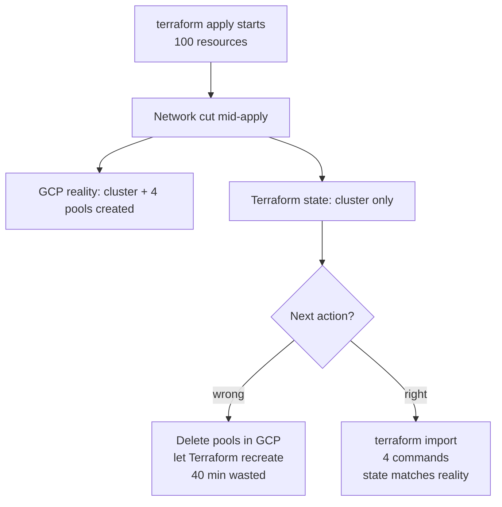

# Terraform state drift after a mid-apply network cut

**TL;DR** — Thirty minutes into a ~100-resource apply, my DNS dropped. Terraform died mid-create. Reality: the GKE cluster and four node pools existed in GCP. Terraform state: cluster present, node pools missing. The next plan wanted to recreate the node pools; the API would have rejected the call because they already exist. The correct move is `terraform import` for each orphaned resource — something you want to practice before you need it in production.

---

## Context

I was applying `fast/tenants/macro/5-workloads-ai` to a brand new QA environment. The plan was large (~100 resources): GKE private cluster, 4 node pools, Cloud SQL, service accounts, IAM bindings, GCS buckets, secrets, Artifact Registry, WIF.

The apply started at 9:30 AM. Around 10:00 AM, my ISP's DNS dropped. Terraform's API connection died in the middle of creating node pools. The CLI returned an error and exited non-zero.

I reconnected, re-ran `terraform plan`, and got this shape:

```
Plan: 4 to add, 0 to change, 0 to destroy.

  + module.gke.google_container_node_pool.pools["system"]
  + module.gke.google_container_node_pool.pools["orchestration"]
  + module.gke.google_container_node_pool.pools["observability"]
  + module.gke.google_container_node_pool.pools["ai-app"]
```

Terraform wanted to create the four node pools. But in the GCP console, the cluster already had all four attached and running.

---

## The trap

**First instinct**: delete the node pools in the console and let Terraform recreate them. This works. But:

- Each node pool takes 7-10 minutes to create.
- Deleting and recreating four in sequence burns ~40 minutes.
- More importantly: **this works only because there is no data yet**. In a future incident with traffic on those nodes, deleting is not an option — you need to reconcile state without touching the live resource.

I did not want to build a habit of "just delete and retry". The correct procedure is `terraform import`, and this was a risk-free chance to practice it.

---

## The solution: `terraform import`

`terraform import` tells Terraform: "this resource exists at real-world address X, and it maps to configuration Y in your code". It writes into the state file without calling the create API.

For each orphaned node pool:

```bash
terraform import \
  'module.gke.google_container_node_pool.pools["system"]' \
  'projects/itmind-macro-ai-qa-0/locations/us-east1-b/clusters/macro-ai-qa-gke/nodePools/system-pool'

terraform import \
  'module.gke.google_container_node_pool.pools["orchestration"]' \
  'projects/itmind-macro-ai-qa-0/locations/us-east1-b/clusters/macro-ai-qa-gke/nodePools/orchestration-pool'

# ... and the other two
```

After four imports, `terraform plan` showed:

- 4 node pools in state, matching reality.
- Some minor attribute diffs (upgrade settings defaulted in config, made explicit in GCP). Expected.
- No destroy/recreate — just in-place updates on the diffs.

I could apply those updates cleanly in the next run.

---

## The subtle details

### 1. The resource address has to match exactly

For a resource inside a `for_each`, the address is `module.MODULE.RESOURCE_TYPE.NAME["KEY"]`. One wrong bracket and the import fails, or worse, imports into the wrong slot.

To confirm the right address:

```bash
# What Terraform expects to manage
terraform state list | grep node_pool

# What the config says
# (look at main.tf and find the for_each/count key)
```

For our chart:

```hcl
resource "google_container_node_pool" "pools" {
  for_each = var.node_pools
  # ...
}
```

The `var.node_pools` map has keys `system`, `orchestration`, etc. So the address is `module.gke.google_container_node_pool.pools["system"]`.

### 2. The import ID format varies per resource

Every resource type has its own import ID format. Check the provider docs.

| Resource | Import ID format |
|----------|------------------|
| `google_container_cluster` | `projects/{project}/locations/{location}/clusters/{name}` |
| `google_container_node_pool` | `projects/{project}/locations/{location}/clusters/{cluster}/nodePools/{name}` |
| `google_sql_database_instance` | `projects/{project}/instances/{name}` |
| `google_storage_bucket` | `{bucket_name}` (just the name, no path) |
| `google_project_iam_member` | `projects/{project} {role} {member}` (space-separated) |

There is no universal pattern. When in doubt, the Terraform registry page for the resource has an "Import" section with the exact format.

### 3. `import` blocks vs `terraform import` CLI

Newer Terraform versions support a declarative `import` block:

```hcl
import {
  to = module.gke.google_container_node_pool.pools["system"]
  id = "projects/itmind-macro-ai-qa-0/locations/us-east1-b/clusters/macro-ai-qa-gke/nodePools/system-pool"
}
```

This goes in your HCL, gets reviewed in PR, runs as part of the next apply. More traceable than a one-off CLI command, especially in team settings. I used the CLI this time because it was a personal incident; I would prefer blocks for anything going into a shared branch.

---

## Diagram



---

## Takeaways

1. **Use a remote state backend with versioning**. GCS bucket with object versioning enabled lets you roll back a corrupted state. Saved me more than once in smaller incidents.

2. **Save a `terraform state list` output before long applies**. If the state goes sideways, you have a reference for what it used to look like.

3. **Learn `terraform import` before you need it**. The syntax and ID formats are finicky. Practice on a low-stakes drift (like this one) so you are calm when the stakes are real.

4. **Prefer `import` blocks over the CLI** in team settings. Code review catches typos in the resource address or the ID. A CLI invocation does not.

5. **Partial applies happen**. Network drops, quota limits, org policies rejecting a later resource — all of them can leave you half-applied. Design your Terraform to tolerate re-runs: idempotent creates, `create_before_destroy` where it matters, timeouts on slow resources.

---

## Stack involved

- Terraform (Google provider)
- GKE private cluster with `for_each` node pools
- Remote state on GCS with versioning

---

## Links / references

- [Terraform import CLI](https://developer.hashicorp.com/terraform/cli/commands/import)
- [Terraform import blocks](https://developer.hashicorp.com/terraform/language/import)
- [Google provider import formats](https://registry.terraform.io/providers/hashicorp/google/latest/docs) (each resource page has an "Import" section)
