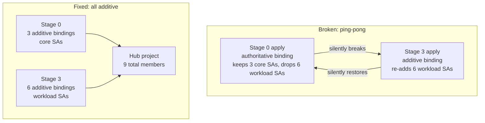

# IAM authoritative vs additive on shared projects — the ping-pong drift

**TL;DR** — Stage 0 of the landing zone declared an IAM binding authoritatively on a hub project. Stage 3 added members to the same role additively. Every `terraform apply` on stage 0 silently dropped the members stage 3 had added. Every apply on stage 3 put them back. Nobody noticed for a while because the `apply` completed successfully on both sides. The fix was a governance rule: on hub projects, no stage uses authoritative bindings, ever.

---

## Context

The landing zone has several stages, each with its own Terraform state, each applied by its own service account:

- **Stage 0 (org-setup)** — creates the core projects (log hub, IaC hub, billing hub, automation hub) and assigns foundational IAM.
- **Stage 3 (project-factory)** — creates tenant/workload projects from YAML templates and assigns per-workload IAM.

Some roles are legitimately shared across stages. The most common: `roles/serviceusage.serviceUsageConsumer` on the automation hub project (`itmind-macro-auto-0`). Every service account that provisions resources needs this role on the hub — stage 0's own SA, stage 3's own SA, and the SAs of every tenant workload that stage 3 creates.

That is the setup. Now the trap.

---

## The trap

Stage 0 declared the binding **authoritatively** using `google_project_iam_binding`:

```yaml
# macro-automation.yaml (stage 0)
iam:
  roles/serviceusage.serviceUsageConsumer:
    - serviceAccount:macro-networking@...
    - serviceAccount:macro-security@...
    - serviceAccount:macro-projects@...
```

That block translates to `google_project_iam_binding`, which means "this role on this project has exactly these members, and only these". Anything else is drift, and Terraform will remove it on apply.

Stage 3, knowing workloads need the same role, added members **additively** using `google_project_iam_member`:

```yaml
# macro-workload.yaml (stage 3, per tenant)
iam_project_roles:
  $project_ids:macro-auto:
    - roles/serviceusage.serviceUsageConsumer  # additive, per workload SA
```

Each workload SA added itself: `macro-ai-dev-ro`, `macro-ai-dev-rw`, `macro-ecm-dev-ro`, `macro-ecm-dev-rw`, `macro-scan-tmp-ro`, `macro-scan-tmp-rw`. Six extra members on the same `(project, role)` pair.

---

## The symptom

When you run stage 0 apply:

```
# google_project_iam_binding.authoritative["roles/serviceusage.serviceUsageConsumer"]
# will be updated in-place
~ members = [
    "serviceAccount:macro-networking@...",
    "serviceAccount:macro-security@...",
    "serviceAccount:macro-projects@...",
  - "serviceAccount:macro-ai-dev-ro@...",
  - "serviceAccount:macro-ai-dev-rw@...",
  - "serviceAccount:macro-ecm-dev-ro@...",
  - "serviceAccount:macro-ecm-dev-rw@...",
  - "serviceAccount:macro-scan-tmp-ro@...",
  - "serviceAccount:macro-scan-tmp-rw@...",
]
```

Six members being **removed**. These are not Terraform-managed in this state — they are the additive members from stage 3. Apply them, and stage 3 is effectively broken: the workload SAs lose their access.

Next stage 3 apply fixes it. Then next stage 0 apply breaks it again. **Ping-pong drift.**

The reason it went undetected for a while: every apply completes with status success. No errors. Just silently reshuffling IAM members between states.

---

## Why this happens

Authoritative IAM in Terraform is a strong claim: "this is the complete list of members, and I own this resource". If another system (another Terraform state, a human via the console, another automation) adds a member, Terraform considers that drift and removes it on apply.

Additive IAM is a softer claim: "add this member to this resource, I do not care who else is there".

The two modes are fundamentally incompatible on the same `(project, role)` pair, by design. Mixing them on a hub resource that multiple stages touch is a footgun built into the IAM API.

---

## The fix: a governance rule

Two changes.

### 1. Remove the authoritative block from stage 0

```diff
# macro-automation.yaml (stage 0)
-iam:
-  roles/serviceusage.serviceUsageConsumer:
-    - serviceAccount:macro-networking@...
-    - serviceAccount:macro-security@...
-    - serviceAccount:macro-projects@...
+iam_bindings_additive:
+  serviceusage-macro-networking:
+    role: roles/serviceusage.serviceUsageConsumer
+    member: serviceAccount:macro-networking@...
+  serviceusage-macro-security:
+    role: roles/serviceusage.serviceUsageConsumer
+    member: serviceAccount:macro-security@...
+  serviceusage-macro-projects:
+    role: roles/serviceusage.serviceUsageConsumer
+    member: serviceAccount:macro-projects@...
```

Stage 0's three core SAs now add themselves additively, symmetric with how stage 3 adds the workload SAs.

### 2. Clean up the orphan authoritative resource from state

```bash
terraform state rm 'module.factory.module.projects-iam["macro-automation"].google_project_iam_binding.authoritative["roles/serviceusage.serviceUsageConsumer"]'
```

Without this, Terraform still thinks the authoritative resource exists (because it is in state) and wants to destroy it — which would wipe all members, both the 3 in stage 0 and the 6 from stage 3.

Next apply: 3 additive resources created (the 3 stage 0 SAs), 0 destroyed, 0 changed on stage 3's side.

---

## The governance rule

This became a written rule in the FAST customization docs for this landing zone:

> **On hub projects (any project shared across stages), IAM bindings must always be additive, not authoritative. Authoritative bindings are only safe on projects owned entirely by a single stage.**

Hub projects in this deployment: `itmind-macro-auto-0`, `itmind-macro-log-0`, `itmind-macro-billing-0`. Any IAM resource on these projects uses `google_project_iam_member` or the FAST `iam_bindings_additive` / `iam_project_roles` pattern. Never `google_project_iam_binding`.

---

## Diagram



---

## Takeaways

1. **On any resource touched by more than one state, use additive IAM only**. Authoritative is safe only when one state owns the full membership list.

2. **Hub projects are the obvious trap**. Identify them early: automation hub, logging hub, billing hub, shared VPC host. IAM on these has to be additive from every stage.

3. **Silent drift is worse than loud drift**. These applies completed with status success. If this had failed the apply, I would have found it immediately. Instead it broke in production after a stage 0 re-apply weeks later.

4. **Terraform state surgery is sometimes the only fix**. Once the authoritative resource is in state, removing the HCL alone is not enough — Terraform will still try to destroy it. `terraform state rm` on the specific address is the right tool.

5. **Write the rule down where people will read it**. A lesson learned that only lives in your head is a lesson the next person will learn again the hard way.

---

## Stack involved

- Terraform Google provider
- `google_project_iam_binding` (authoritative) vs `google_project_iam_member` (additive)
- Cloud Foundation Fabric / FAST framework
- Multi-stage landing zone

---

## Links / references

- [Terraform Google IAM resources — authoritative vs additive](https://registry.terraform.io/providers/hashicorp/google/latest/docs/resources/google_project_iam)
- [FAST IAM additive helpers](https://github.com/GoogleCloudPlatform/cloud-foundation-fabric/blob/master/modules/iam-service-account/README.md)
