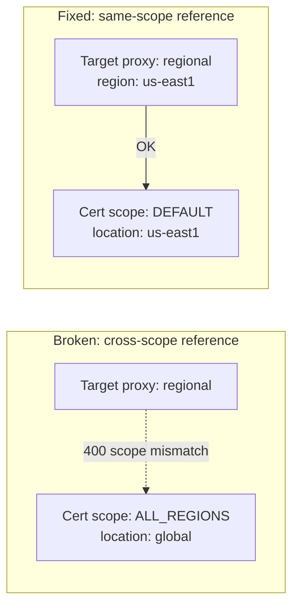

# Certificate Manager — regional and global are not interchangeable

**TL;DR** — I created a Certificate Manager certificate with `scope = "ALL_REGIONS"` (global) and tried to attach it to a Regional Internal Application Load Balancer. The target HTTPS proxy rejected it with a 400. Certificate Manager enforces strict scope matching: a regional target can only reference a regional certificate, and a global target can only reference a global one. The fix was creating the certificate with `location = var.region` instead. Obvious in hindsight, not so obvious from the docs.

---

## Context

Setting up an Internal HTTPS Application Load Balancer in front of an internal service running on GKE. The design:

- **Regional Internal Application Load Balancer** (not global — traffic stays inside the VPC in one region)
- **Certificate Manager** for the TLS cert, using DNS authorization for domain validation
- One region, one VPC, one target

Certificate Manager has two main scopes:

- `DEFAULT` (regional) — certificate is created in a specific region, usable only by resources in that region
- `ALL_REGIONS` (global) — certificate is replicated across all regions, usable by global load balancers

I picked `ALL_REGIONS` on the assumption that "global = more flexible, less to worry about".

---

## The symptom

Terraform applied the `google_certificate_manager_certificate` resource cleanly. DNS authorization too. When it got to the `google_compute_region_target_https_proxy`:

```
Error creating RegionTargetHttpsProxy: googleapi: Error 400:
ssl_certificates: Certificate ... has scope ALL_REGIONS (global)
but the target proxy is regional; they must be in the same scope.
```

The regional target proxy refused to reference the global certificate.

---

## The diagnosis

The Certificate Manager docs mention scopes, but they do not spell out the compatibility matrix as a hard rule. You have to either read between the lines or hit this error to realize:

| LB type | Target proxy | Allowed cert scope |
|---------|--------------|--------------------|
| Global External LB | Global | `ALL_REGIONS` |
| Global Internal LB | Global | `ALL_REGIONS` |
| Regional External LB | Regional | `DEFAULT` (regional) |
| Regional Internal LB | Regional | `DEFAULT` (regional) |

There is no "global cert for everything" option. The scope of the certificate has to match the scope of the proxy exactly.

---

## The fix

Two resources changed — the certificate and the DNS authorization:

```hcl
# Before (broken):
resource "google_certificate_manager_certificate" "ecm_fe" {
  name     = "macro-ecm-dev-cert"
  scope    = "ALL_REGIONS"
  location = "global"

  managed {
    domains            = [var.domain]
    dns_authorizations = [google_certificate_manager_dns_authorization.ecm_fe.id]
  }
}

resource "google_certificate_manager_dns_authorization" "ecm_fe" {
  name     = "macro-ecm-dev-dns-auth"
  location = "global"
  domain   = var.domain
}

# After (working):
resource "google_certificate_manager_certificate" "ecm_fe" {
  name     = "macro-ecm-dev-cert"
  location = var.region   # regional

  managed {
    domains            = [var.domain]
    dns_authorizations = [google_certificate_manager_dns_authorization.ecm_fe.id]
  }
  # no `scope` field — defaults to DEFAULT (regional)
}

resource "google_certificate_manager_dns_authorization" "ecm_fe" {
  name     = "macro-ecm-dev-dns-auth"
  location = var.region   # regional
  domain   = var.domain
}
```

Cleanup in GCP before Terraform could recreate them cleanly:

```bash
gcloud certificate-manager certificates delete macro-ecm-dev-cert --location=global
gcloud certificate-manager dns-authorizations delete macro-ecm-dev-dns-auth --location=global

terraform state rm 'google_certificate_manager_certificate.ecm_fe'
terraform state rm 'google_certificate_manager_dns_authorization.ecm_fe'
```

After the scope change, the `_acme-challenge` CNAME had to be re-published (it is per-DNS-authorization, and we created a new one in the region).

---

## Diagram



---

## Takeaways

1. **Certificate scope must match target proxy scope exactly**. `ALL_REGIONS` ≠ "compatible with anything". It means "global tier", which is its own distinct bucket.

2. **Default to regional certificates for regional LBs**. It is the right choice 90% of the time and avoids quota / propagation complexity you do not need.

3. **DNS authorization is scoped too**. If you have to recreate the cert in a different scope, the DNS auth has to move too — which means the `_acme-challenge` CNAME record you pushed to your DNS provider is now useless. Pull the new one from the new authorization and re-publish.

4. **Resource cleanup order matters**. `google_certificate_manager_dns_authorization` cannot be deleted while a certificate references it. Delete the cert first, then the auth.

5. **Read the target proxy docs, not the cert docs**. The compatibility rule is better documented on the `google_compute_region_target_https_proxy` page than on the certificate page. Whichever side you are coming from, check both.

---

## Stack involved

- GCP Certificate Manager (DNS authorization mode)
- Regional Internal Application Load Balancer
- Terraform `google_certificate_manager_certificate`, `google_certificate_manager_dns_authorization`, `google_compute_region_target_https_proxy`

---

## Links / references

- [Certificate Manager scopes](https://cloud.google.com/certificate-manager/docs/overview#certificate-scopes)
- [Regional target HTTPS proxy](https://cloud.google.com/load-balancing/docs/https#regional-ssl-certificates)
- [DNS authorization for certs](https://cloud.google.com/certificate-manager/docs/dns-authorizations)
