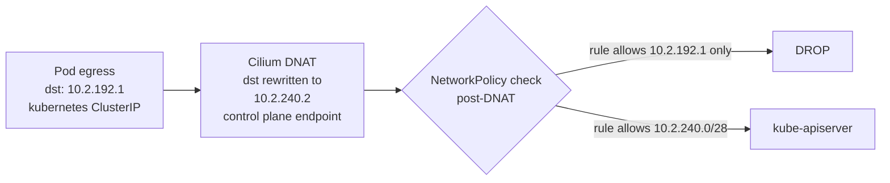

# NetworkPolicy on GKE with Cilium — policies are evaluated post-DNAT

**TL;DR** — Airflow's KubernetesJobWatcher was stuck in a continuous timeout loop trying to reach the Kubernetes API. The NetworkPolicy allowed egress to the kube-apiserver ClusterIP (`10.2.192.1/32`), which is correct under standard kube-proxy. But this cluster uses Cilium with `ADVANCED_DATAPATH`, where policy evaluation happens **after** DNAT. By the time Cilium checked the policy, the destination was the control plane endpoint (`10.2.240.2`), not the ClusterIP. The fix was adding the master CIDR to the egress rule.

---

## Context

- GKE cluster with `networkConfig.datapathProvider = ADVANCED_DATAPATH` (Cilium as the CNI, also called "GKE Dataplane V2").
- Airflow 3 deployed via Helm, using the `KubernetesExecutor`. Each task becomes a pod.
- The scheduler runs a component called `KubernetesJobWatcher` that watches the API server for pod status changes on the tasks it submitted.
- A default-deny NetworkPolicy on the `airflow` namespace, with explicit egress rules for the things Airflow needs (kube-apiserver, Cloud SQL, Redis, GCS, etc.).

The egress rule for the API server looked reasonable:

```yaml
egress:
  - to:
    - namespaceSelector:
        matchLabels:
          kubernetes.io/metadata.name: default
      podSelector:
        matchLabels:
          k8s-app: kube-apiserver
    ports:
      - protocol: TCP
        port: 443
```

Standard pattern. With kube-proxy, this would work. With Cilium ADVANCED_DATAPATH, it does not.

---

## The symptom

Airflow's scheduler logs, every 60 seconds:

```
[airflow.executors.kubernetes_executor.KubernetesJobWatcher] 
Watch died: read operation timed out

Stream closed EOF for default (airflow-scheduler-...)
```

Tasks submitted via the `KubernetesExecutor` would start (the Job was created, the pod ran, the task completed), but the scheduler never marked them as finished. The pods showed up as stuck `running` or `queued` in the Airflow UI, even after the K8s Job was `Completed`. Hours later, some of them got cleaned up by timeouts; most just piled up.

---

## First diagnosis (wrong)

"The NetworkPolicy is wrong. The `k8s-app=kube-apiserver` selector does not match the real API server pods in GKE." So I tried tightening it with explicit CIDRs to the ClusterIP:

```yaml
egress:
  - to:
    - ipBlock:
        cidr: 10.2.192.1/32   # ClusterIP of kubernetes service
    ports:
      - protocol: TCP
        port: 443
```

Still blocked. Same timeout.

---

## The real diagnosis

On GKE with Cilium ADVANCED_DATAPATH, NetworkPolicy is evaluated **after** DNAT by the Cilium datapath. Packet flow for a pod reaching the API server via the `kubernetes` service:

1. Pod sends traffic to `10.2.192.1:443` (kube-apiserver ClusterIP).
2. Cilium resolves the service and DNATs the packet to the actual control plane endpoint IP — in a private GKE cluster, this is an address inside the `master_cidr` (in this deployment: `10.2.240.0/28`).
3. **Then** Cilium evaluates the NetworkPolicy egress rules against the packet's **post-DNAT** destination.
4. My rule said "allow egress to `10.2.192.1/32`". Cilium saw the packet heading to `10.2.240.2`. Match failed. Packet dropped.

Under standard kube-proxy (iptables), the policy engine sees the pre-DNAT address (the ClusterIP). Under Cilium, it sees the post-DNAT address (the endpoint). This is a documented Cilium behavior but easy to miss.

---

## The fix

Allow both CIDRs in the egress rule:

```yaml
egress:
  - to:
    # ClusterIP of kubernetes service. Needed for some routing paths
    # (and it is what tools like kubectl see, so include it for clarity).
    - ipBlock:
        cidr: 10.2.192.1/32
    # master_cidr — the actual control plane endpoint IP range.
    # With Cilium ADVANCED_DATAPATH, NetworkPolicy is evaluated
    # post-DNAT, so the real destination seen by the policy is here.
    - ipBlock:
        cidr: 10.2.240.0/28
    ports:
      - protocol: TCP
        port: 443
```

Deployed. Scheduler logs cleared. Tasks submitted through `KubernetesExecutor` complete and the watcher updates the DAG state correctly.

---

## How I confirmed it was Cilium-specific

Two checks in parallel:

1. The cluster config: `gcloud container clusters describe macro-ai-dev-gke --format 'value(networkConfig.datapathProvider)'` → `ADVANCED_DATAPATH`. Confirmed Cilium.

2. Cilium's own diagnostic tool: `hubble observe --pod airflow-scheduler-xxx --verdict DROPPED` showed packets to `10.2.240.2:443` being dropped with reason `Policy denied`. That was the smoking gun — the policy engine was rejecting a post-DNAT destination.

Hubble is invaluable for this. Without it I would have spent a lot more time guessing.

---

## Diagram



---

## Takeaways

1. **Cilium and kube-proxy evaluate NetworkPolicy at different points in the packet path**. kube-proxy evaluates before DNAT; Cilium evaluates after. Policies that work on one may not work on the other. Know which CNI your cluster uses.

2. **For egress to the kube-apiserver on private GKE, allow both the ClusterIP and the master CIDR**. Belt and braces — works on both kube-proxy and Cilium, works across upgrades that might change internal routing.

3. **Hubble is the right tool for Cilium diagnostics**. `hubble observe --verdict DROPPED` tells you exactly which packets are being blocked and which policy rule evaluated to deny. `tcpdump` inside the pod will not help because the traffic is dropped by the datapath before it leaves.

4. **"Default deny" policies need rigorous test coverage**. The Airflow scheduler worked fine on cluster bring-up — the policy drop only manifested when the `KubernetesJobWatcher` did its periodic watch. Intermittent symptoms often point to policy/filtering issues that only trigger on specific traffic patterns.

5. **The CNI is an architectural choice, not just a configuration**. Switching from kube-proxy to Cilium brings visibility, performance, and security benefits, but also a different mental model for NetworkPolicies. Document it as a constraint for every team shipping workloads.

---

## Stack involved

- GKE with `ADVANCED_DATAPATH` (Cilium as CNI, aka Dataplane V2)
- Airflow 3 `KubernetesExecutor` with `KubernetesJobWatcher`
- Private GKE cluster with master CIDR `10.2.240.0/28`
- NetworkPolicy with default-deny plus explicit allows

---

## Links / references

- [GKE Dataplane V2 (Cilium) announcement](https://cloud.google.com/kubernetes-engine/docs/concepts/dataplane-v2)
- [Cilium NetworkPolicy and DNAT semantics](https://docs.cilium.io/en/stable/policy/language/#layers-of-policy-enforcement)
- [Hubble observability](https://docs.cilium.io/en/stable/gettingstarted/hubble_setup/)
