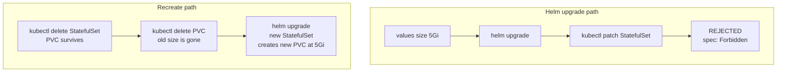

# StatefulSet volumeClaimTemplates are immutable — resize requires surgery

**TL;DR** — The Airflow triggerer StatefulSet had a 100 GiB PVC. I wanted to drop it to 5 GiB (the workload genuinely does not need that much). Changed the Helm value, ran `helm upgrade`. The upgrade failed with `StatefulSet is invalid: spec: Forbidden`. Turns out `volumeClaimTemplates` on a StatefulSet are immutable — you cannot change them in place. The fix is to delete the StatefulSet (the PVCs stay), let Helm recreate it with the new template, and let the new pods mount new PVCs.

---

## Context

Airflow 3 deployed via the official Helm chart on GKE. The triggerer component runs as a StatefulSet, and the Helm chart creates a PVC per replica via `volumeClaimTemplates`. The default in the chart was 100 GiB, which is way more than the triggerer needs — it stores a small state database for deferred tasks, measured in MB, not GB.

Shrinking it was a housekeeping item: fit more pods on the quota budget (see also [SSD_TOTAL_GB quota story](./13-ssd-quota-includes-pd-balanced.md)).

In `values.yaml`:

```yaml
triggerer:
  persistence:
    size: 5Gi  # was 100Gi
```

---

## The symptom

`helm upgrade airflow airflow/airflow -f values.yaml`:

```
Error: UPGRADE FAILED:
cannot patch "airflow-triggerer" with kind StatefulSet:
StatefulSet.apps "airflow-triggerer" is invalid: spec:
Forbidden: updates to statefulset spec for fields other than
'replicas', 'ordinals', 'template', 'updateStrategy',
'revisionHistoryLimit', 'persistentVolumeClaimRetentionPolicy'
and 'minReadySeconds' are forbidden
```

Kubernetes is telling me: `volumeClaimTemplates` is not in the allowed list of fields to modify on a StatefulSet. It is immutable after creation.

---

## Why

StatefulSets are special because they tie pods to persistent identity and storage. When a StatefulSet scales down and back up, the same pod (by ordinal) gets the same PVC. That guarantee depends on the PVC specs staying stable. Allowing arbitrary changes to `volumeClaimTemplates` would break the contract — you could resize a claim under a running pod, or worse, change the storage class.

Kubernetes chose the strict path: most of `volumeClaimTemplates` is frozen after the StatefulSet is created. Since Kubernetes 1.27 there is [alpha support](https://kubernetes.io/docs/concepts/workloads/controllers/statefulset/#persistentvolumeclaim-retention) for resizing the storage field only, gated behind the feature gate `StatefulSetAutoDeletePVC`. In GKE Standard (the version this cluster is on), that feature gate is not enabled.

---

## The fix

The recipe is well-known but worth writing down because it only comes up every few years:

```bash
# 1. Delete the StatefulSet. This does NOT delete the PVCs
#    (PVCs have their own lifecycle). Pods die.
kubectl delete statefulset airflow-triggerer -n airflow

# 2. Run helm upgrade. Helm sees the StatefulSet missing, recreates
#    it with the new volumeClaimTemplates. New pods come up.
helm upgrade airflow airflow/airflow -f values.yaml
```

What happened with the PVCs:

- Deleting the StatefulSet left `data-airflow-triggerer-0` (the existing 100 GiB PVC) in place, unbound.
- The new StatefulSet's `volumeClaimTemplates` says 5 GiB with a specific storage class. Kubernetes tried to create a new PVC `data-airflow-triggerer-0`.
- Kubernetes saw a PVC with that name already existed (100 GiB). Kubernetes rule: if the PVC exists, attach it; do not create a new one.
- The new pod attached to the old 100 GiB PVC — **not** the new 5 GiB spec I wanted.

I had to delete the PVC too:

```bash
kubectl delete pvc data-airflow-triggerer-0 -n airflow
```

Then re-run `helm upgrade` (or let the StatefulSet's pod restart trigger creation). The new PVC came up as 5 GiB.

There was a brief window — maybe 30 seconds — where the triggerer had no pod and no state DB. Since deferred tasks flush state frequently, no tasks were lost in practice. For a workload where that gap is unacceptable, the procedure is different (see below).

---

## The variant: scaling up instead of down

Scaling a PVC up (e.g., 100 GiB → 200 GiB) has a different path. With a storage class that supports `allowVolumeExpansion: true`:

```bash
# Edit the PVC directly (bypassing the StatefulSet template)
kubectl edit pvc data-airflow-triggerer-0 -n airflow
# change spec.resources.requests.storage to 200Gi
```

Kubernetes expands the PVC online (the filesystem resize happens on the next pod restart, or automatically if supported). The StatefulSet's template is still stale — it says 100 GiB — but the PVC is now 200. The template only matters when Kubernetes needs to create a new PVC (e.g., a new replica). For existing PVCs, you can sidestep the template.

This also applies to shrink if your storage class supported online shrink, which most do not. That is why the triggerer required the surgical procedure above.

---

## Diagram



---

## Takeaways

1. **StatefulSet `volumeClaimTemplates` are immutable** except for a small allowlist (`replicas`, `template`, `updateStrategy`, a few others). Plan for this when designing workloads with persistent storage.

2. **Deleting a StatefulSet does not delete its PVCs**. This is good — it protects you from accidentally losing data — but means you have to delete PVCs separately if you want Kubernetes to re-create them with new specs.

3. **Orphan PVCs steal template changes**. If a PVC with the expected name exists, Kubernetes attaches it as-is. New template = irrelevant for existing PVCs. Only new PVCs respect the updated template.

4. **Expand online, shrink via recreate**. If you only ever grow PVCs, and you use a storage class with `allowVolumeExpansion: true`, you can edit the PVC directly. Shrinking almost always requires recreate.

5. **Storage for stateful workloads should be sized with a plan**, not a default. The Helm chart's 100 GiB default for the triggerer is reasonable for "I do not know the workload"; for Airflow specifically, 5 GiB is plenty, and 100 GiB wastes quota. Override defaults that are not true for your workload.

---

## Stack involved

- Kubernetes StatefulSet (GKE 1.28)
- Airflow 3 Helm chart, `airflow-triggerer` component
- Storage class `standard-rwo` (pd-balanced SSD)
- No `StatefulSetAutoDeletePVC` feature gate (GKE Standard)

---

## Links / references

- [StatefulSet docs — updateStrategy and immutability](https://kubernetes.io/docs/concepts/workloads/controllers/statefulset/#update-strategies)
- [Expanding PersistentVolumeClaims](https://kubernetes.io/docs/concepts/storage/persistent-volumes/#expanding-persistent-volumes-claims)
- [Feature gate: StatefulSetAutoDeletePVC](https://kubernetes.io/docs/concepts/workloads/controllers/statefulset/#persistentvolumeclaim-retention)
