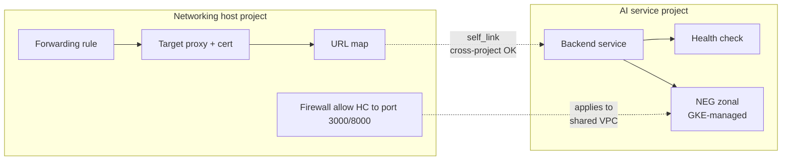

# Shared VPC and cross-project NEG references — the backend service won't do it

**TL;DR** — In a Shared VPC setup, the load balancer resources (forwarding rule, URL map) live in the networking host project, and the GKE cluster (with its Network Endpoint Groups) lives in the workload service project. I tried creating the backend services in the host project and referencing cross-project NEGs. GCP refused with "cross-project references for this resource are not allowed". The right shape is: **health checks and backend services move to the service project**, and the host project's URL map references them by `self_link` — URL map cross-project references are allowed, backend service cross-project references are not.

---

## Context

The project layout, standard for Shared VPC:

- **Networking host project** (`itmind-macro-net-dev`): owns the VPC, subnets, firewall rules, load balancer frontends (forwarding rule, target proxy, URL map, SSL cert).
- **Service project** (`itmind-macro-ai-dev`): owns the GKE cluster, the workloads, and therefore the zonal Network Endpoint Groups that GKE creates automatically for Services with `cloud.google.com/neg: '{"ingress": true}'` annotations.

The goal: a Regional Internal Application Load Balancer in the host project, fronting a FastAPI backend and a Next.js frontend on GKE in the service project.

Naively, I tried to put the whole LB stack in the host project:

```hcl
# in host project
resource "google_compute_backend_service" "ea_fe" {
  project = var.host_project_id   # networking project
  # ...
  dynamic "backend" {
    for_each = data.google_compute_network_endpoint_group.gke_ea_frontend  # NEGs in service project
    content {
      group = backend.value.id
    }
  }
}
```

---

## Attempt 1: give the host SA read access to the NEGs

First error, on `terraform plan`:

```
Error: Error reading NetworkEndpointGroup:
googleapi: Error 403: Required 'compute.networkEndpointGroups.get' permission
for 'projects/itmind-macro-ai-dev/zones/us-east1-b/networkEndpointGroups/...'
```

The networking SA that runs Terraform for the host project did not have read access to NEGs in the service project. I added `roles/compute.viewer` on the service project. Re-ran plan.

---

## Attempt 2: give the host SA use access to the NEGs

Next error, on `terraform apply`:

```
Error: Error creating BackendService:
googleapi: Error 403: Required 'compute.networkEndpointGroups.use' permission
```

"Use" is a stronger permission than read. I bumped the networking SA to `roles/compute.networkAdmin` on the service project (still bounded by VPC-SC, the permission expansion is scoped). Re-ran apply.

---

## Attempt 3: the actual blocker

```
Error: Error creating BackendService:
googleapi: Error 400: Cross-project references for this resource are not allowed.
```

Not a permission error. A policy one. The backend service resource in the host project cannot reference a NEG in the service project. Period. Even with full permissions.

---

## The diagnosis

Backend services in regional LBs have a limitation: the NEGs (or instance groups) they reference must be in the **same project as the backend service**. This is not a Shared VPC limitation — it is a GCP backend service limitation. URL maps, on the other hand, can reference backend services in different projects by `self_link`.

The right architectural shape:

```
Host project (networking):
├── Forwarding rule
├── Target HTTPS proxy + SSL cert
└── URL map
    └── references → backend service (via self_link)

Service project (AI):
├── GKE cluster
├── NEGs (auto-created by GKE)
├── Health checks
└── Backend services
    └── references → NEGs (same project, OK)
```

---

## The fix

Terraform refactor: move two resource types to the service project.

```hcl
# Before (broken):
resource "google_compute_health_check" "ea_fe" {
  project = var.host_project_id   # networking
  # ...
}

resource "google_compute_backend_service" "ea_fe" {
  project = var.host_project_id   # networking
  health_checks = [google_compute_health_check.ea_fe.id]
  dynamic "backend" {
    for_each = data.google_compute_network_endpoint_group.gke_ea_frontend
    content { group = backend.value.id }
  }
}

# After (working):
resource "google_compute_health_check" "ea_fe" {
  project = var.banco_ai_project_id   # service
  # ...
}

resource "google_compute_backend_service" "ea_fe" {
  project = var.banco_ai_project_id   # service
  health_checks = [google_compute_health_check.ea_fe.id]
  dynamic "backend" {
    for_each = data.google_compute_network_endpoint_group.gke_ea_frontend  # now same project
    content { group = backend.value.id }
  }
}

# URL map stays in host, references backend via self_link
resource "google_compute_url_map" "ea" {
  project         = var.host_project_id   # networking
  default_service = google_compute_backend_service.ea_fe.self_link   # cross-project OK for URL map
}
```

The URL map's `default_service` accepts a fully-qualified `self_link` (`//compute.googleapis.com/projects/.../global/backendServices/...`) across projects. The backend service's `backend.group` does not accept cross-project references.

---

## Health check subtleties

When the health check moves to the service project, the health check prober's source IP is still `35.191.0.0/16` and `130.211.0.0/22` (Google's standard HC ranges), but now it needs a firewall rule in **the host project's VPC** (since that is where the GKE nodes live — Shared VPC).

```hcl
resource "google_compute_firewall" "allow_hc_to_gke_ai_pods" {
  project = var.host_project_id   # firewall is on the host VPC
  name    = "allow-hc-to-gke-ai-pods"
  network = var.host_vpc_name

  source_ranges = ["35.191.0.0/16", "130.211.0.0/22"]
  target_tags   = ["gke-node"]   # GKE nodes get this tag by default

  allow {
    protocol = "tcp"
    ports    = ["3000", "8000"]   # frontend and backend target ports
  }
}
```

Without that firewall, health checks never reach the nodes. Pods look fine, backend shows all endpoints as unhealthy, LB returns 502.

---

## Diagram



---

## Takeaways

1. **Backend services and NEGs must be in the same project**. This is a hard GCP rule, not a permission issue. Read errors are a red herring — the real rejection is "cross-project references are not allowed" which only shows up on write.

2. **URL maps can cross project boundaries**. That is the pivot: keep the URL map in the host project (so it ties into the LB frontend there), and push backend services to the service project (so they can reference local NEGs).

3. **Health checks follow backend services**. If a backend service moves to the service project, its health check should too. Firewall rules on the Shared VPC to allow HC source ranges to reach the nodes stay in the host project.

4. **VPC-SC can mask the real error**. In our environment, the first couple of failures were permission-related and looked solvable by widening IAM. We bumped to `networkAdmin` before hitting the actual policy rejection. Do not assume "403" means "needs more IAM" without checking whether the next layer down is an outright refusal.

5. **In Shared VPC, draw the project boundary carefully**. A clean rule: **frontend (forwarding rule, target proxy, URL map, cert) in host; backend (backend service, health check, NEG, workload) in service**. This maps to the ownership model: networking team owns the door, app team owns the room.

---

## Stack involved

- Shared VPC (host + service projects)
- Regional Internal Application Load Balancer
- GKE private cluster with container-native load balancing (NEGs)
- Terraform `google_compute_*` resources
- VPC Service Controls active on all projects

---

## Links / references

- [Backend services and cross-project references](https://cloud.google.com/load-balancing/docs/l7-internal/internal-shared-vpc-overview)
- [Container-native load balancing with NEGs](https://cloud.google.com/kubernetes-engine/docs/concepts/container-native-load-balancing)
- [Health check firewall rules](https://cloud.google.com/load-balancing/docs/health-checks#firewall_rules)
