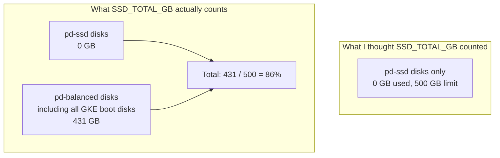

# SSD_TOTAL_GB quota on GCP includes pd-balanced — and GKE defaults to pd-balanced

**TL;DR** — The GKE cluster hit the regional `SSD_TOTAL_GB` quota at 86% utilization — while I had not created a single `pd-ssd` disk. It turns out that quota aggregates **all SSD-class disks**, including `pd-balanced`, which is GKE's default boot disk type. A missing single-zone configuration in the QA tfvars was creating node pools in two zones by default, doubling the boot disk count and burning quota on nodes that would never scale up.

---

## Context

The QA environment was running for a few weeks when Helm deploys started failing intermittently. The symptom: some pods would go `Pending` and the cluster autoscaler would try to create a new node, then give up.

```
Events:
  Warning  FailedScaleUp  cluster-autoscaler  Could not scale up: Max quota reached
    for pd resource 'SSD_TOTAL_GB'. Current usage: 431 GB, Limit: 500 GB
```

431 GB of SSD storage, and I had not deliberately provisioned a single `pd-ssd`. GKE boot disks, Cloud SQL, PVCs from stateful workloads — somewhere the math added up to 431 and I did not see how.

---

## The diagnosis

Pulled the list of disks in the region:

```bash
$ gcloud compute disks list --filter "region:(us-east1)" \
  --format "table(name,sizeGb,type.basename())"

NAME                                           SIZE_GB  TYPE
gke-macro-ai-qa-gke-system-pool-xxx-node-1     100      pd-balanced
gke-macro-ai-qa-gke-system-pool-yyy-node-1     100      pd-balanced
gke-macro-ai-qa-gke-orchestration-pool-xxx-n   50       pd-balanced
gke-macro-ai-qa-gke-orchestration-pool-yyy-n   50       pd-balanced
...
(total: ~431 GB across pd-balanced boot disks + PVCs)
```

Not a single `pd-ssd`. Every disk was `pd-balanced` (GKE's default).

Cross-referenced with the [GCP quota docs](https://cloud.google.com/compute/docs/disks#disk-types):

> `SSD_TOTAL_GB` limits the total size of SSD-backed persistent disks (both `pd-ssd` and `pd-balanced`) in a region.

`pd-balanced` is SSD-backed (NVMe-equivalent throughput at a cheaper price point than `pd-ssd`). It counts. The quota name is misleading — "SSD" here means "any SSD-class", not specifically `pd-ssd`.

---

## The second finding: QA was accidentally multi-zone

Looked at `envs/qa.tfvars`:

```hcl
system_min_nodes           = 1
system_max_nodes           = 2
orchestration_min_nodes    = 1
orchestration_max_nodes    = 4
observability_min_nodes    = 1
observability_max_nodes    = 2
ai_app_min_nodes           = 1
ai_app_max_nodes           = 4
# (no *_node_locations variables)
```

The Terraform module defaulted `system_node_locations` to `["us-east1-b", "us-east1-c"]` (multi-zone). Same for the others. So `system_max_nodes = 2` was being interpreted as "up to 2 nodes per zone, in 2 zones" = up to 4 nodes total. Each node with a 100 GB boot disk. That alone was 400 GB of quota reserved against a 500 GB limit.

I compared with `envs/dev.tfvars`, which worked fine:

```hcl
system_node_locations          = ["us-east1-b"]  # single zone
orchestration_node_locations   = ["us-east1-b"]  # single zone
```

The dev tfvars set the locations explicitly to a single zone. QA had inherited the default (multi-zone) by omission. That was the 150 GB gap — six extra boot disks across zones.

---

## The fix

Added explicit single-zone configuration to `envs/qa.tfvars`:

```hcl
system_node_locations          = ["us-east1-b"]
orchestration_node_locations   = ["us-east1-b"]
observability_node_locations   = ["us-east1-b"]
ai_app_node_locations          = ["us-east1-b"]

# also tightened max nodes since QA doesn't need HA:
system_max_nodes         = 1
observability_max_nodes  = 1
```

Apply. The autoscaler drained the nodes in `us-east1-c`, their boot disks were deleted, and quota usage dropped from 431 GB to about 281 GB. Deploys started passing again.

The underlying QA workload did not lose availability during the transition — pods rescheduled to the remaining zone as the other zone drained. If the cluster had real multi-zone HA requirements, this would not have been the right move.

---

## Why this specific gotcha hurts

Three reasons this one lost me time:

1. **Quota name is misleading**. I searched the quota page for `pd-ssd` and saw numbers matching my expectations. The "SSD" in `SSD_TOTAL_GB` aggregating `pd-balanced` is only spelled out in the docs if you read the disk types page (which explains `pd-balanced` is SSD-backed).

2. **The default node locations are set by the module, not by GKE itself**. Reading only `qa.tfvars` shows no multi-zone config — it feels single-zone. The multi-zone actually lives in `variables.tf` default values. Every implicit default is a place where environments drift apart.

3. **Quota errors come from the autoscaler, not the apply**. Terraform applied successfully when I first brought up the cluster — quota was fine at 100 GB. Only when workloads actually caused scale-up months later did the error appear, with no link back to the original configuration decision.

---

## Diagram



---

## Takeaways

1. **`SSD_TOTAL_GB` includes `pd-balanced`**. GKE defaults to `pd-balanced` for boot disks. Any multi-node cluster eats this quota regardless of whether you provision `pd-ssd` deliberately.

2. **Implicit multi-zone in node pools is expensive in pre-prod**. QA and dev environments rarely need HA across zones. Setting `node_locations = [single_zone]` explicitly halves boot disk count and node count budgets.

3. **Module defaults are environment policy**. If `variables.tf` defaults to multi-zone, every `tfvars` that omits the override inherits it. Either make defaults conservative (single-zone) and force multi-zone to be explicit, or require every `tfvars` to state its choice.

4. **Quota errors are temporally displaced from their cause**. The configuration that will exhaust the quota can be set months before the quota is hit. Run a capacity check after any cluster resize — actual disk usage from `gcloud compute disks list` against quota limits.

5. **The cheapest disk for GKE boot is `pd-standard`** (HDD-backed). Not recommended for production nodes because it hurts pod startup times and etcd-like workloads, but for cost-optimized dev/QA with low churn it is a legitimate option that does not touch the SSD quota at all.

---

## Stack involved

- GCP Compute quotas (`SSD_TOTAL_GB`, regional)
- GKE node pool boot disks (default: `pd-balanced`)
- Terraform node pool locations (`node_locations` = list of zones)
- Cluster Autoscaler

---

## Links / references

- [GCP persistent disk types](https://cloud.google.com/compute/docs/disks#disk-types)
- [Compute Engine quotas reference](https://cloud.google.com/compute/quotas)
- [GKE node pool boot disk configuration](https://cloud.google.com/kubernetes-engine/docs/concepts/node-pools#boot_disks)
