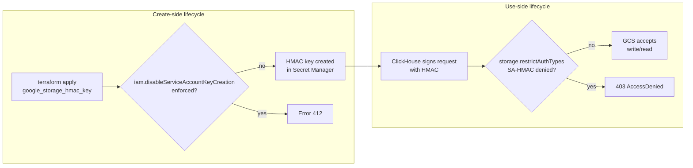

# Two org policies, overlapping names, one HMAC key

**TL;DR** — I had already overridden `storage.restrictAuthTypes` at the QA folder so that GCS would accept HMAC-signed requests. Weeks later, running `terraform apply` on the same HMAC key failed with `Error 412`. The error named a *different* constraint, `iam.disableServiceAccountKeyCreation`, that I had never heard act on HMAC. Turns out both constraints govern the HMAC lifecycle — one on the create call, one on the authentication call — and unblocking one does not unblock the other.

---

## Context

A ClickHouse workload in the QA tenant needs to write to a GCS bucket. The image we inherited (Bitnami 25.2.1) only supports GCS through its S3-compatible API, which requires HMAC credentials signed by a service account.

Our landing zone is the standard [FAST](https://github.com/GoogleCloudPlatform/cloud-foundation-fabric) multi-tenant layout. The relevant folder hierarchy:

```
Organization
└── Tenants (hardened root)
    └── Macro
        ├── dev
        ├── qa    ← workload lives here
        └── prod
```

Weeks earlier (war story #05 in spirit), we had already overridden four org-level policies at the QA folder — including `storage.restrictAuthTypes`, which by default denies any request to GCS signed with an HMAC user-account key. The override added `USER_ACCOUNT_HMAC_SIGNED_REQUESTS` to `deniedValues` but left `SERVICE_ACCOUNT_HMAC_SIGNED_REQUESTS` allowed, so GCS would accept HMAC requests coming from a service account.

I considered HMAC unblocked.

---

## The symptom

Applying the Terraform for the HMAC key of the ClickHouse SA:

```hcl
resource "google_storage_hmac_key" "langfuse_clickhouse" {
  service_account_email = module.langfuse_wi.email
  project               = var.project_id
}
```

failed with:

```
Error: Error creating HmacKey: googleapi: Error 412:
Request violates constraint 'constraints/iam.disableServiceAccountKeyCreation',
conditionNotMet
  with google_storage_hmac_key.langfuse_clickhouse,
  on langfuse.tf line 117
```

I had never set `iam.disableServiceAccountKeyCreation` on purpose. Running `gcloud org-policies describe ... --effective` confirmed it was `enforce: true`, inherited from the hardened tenant root. The QA folder had no override for it.

The instinct was: "this is `storage.restrictAuthTypes` again — I'll just override it the same way and move on." But the error message named a *different* constraint, and the two policies sit in completely different corners of IAM.

---

## Attempt 1: stretch the existing deny policy in `2-security`

We already had an IAM deny policy in the tenant's `2-security` stage, `protect_sa_keys`, that denies `iam.googleapis.com/serviceAccountKeys.create` at the tenant folder. My first idea was to carve an exception there for the Langfuse workload SA.

**Result**: didn't apply. HMAC keys are created through `storage.hmacKeys.create`, not `iam.googleapis.com/serviceAccountKeys.create`. The existing deny policy never even fires on an HMAC create. Two different APIs, same mental model of "a key for a service account", but completely orthogonal governance surfaces.

---

## Attempt 2: override `iam.disableServiceAccountKeyCreation` from `2-security` or `5-workloads-ai`

These are the two stages where we routinely add policy-ish things per tenant. Both have a tenant-scoped SA: `macro-security` for `2-security`, `macro-ai-qa-rw` for `5-workloads-ai`. Either would be close to the workload and easy to reason about.

```bash
gcloud org-policies describe iam.disableServiceAccountKeyCreation \
  --folder=<qa-folder-id> \
  --impersonate-service-account=macro-security@...
# Permission 'orgpolicy.policies.get' denied on resource
```

**Result**: neither SA has `roles/orgpolicy.policyAdmin` anywhere. And as discussed in war story #05, they should not — granting an app-stage SA the ability to rewrite org policies is exactly the kind of lateral-privilege move a landing zone is supposed to prevent.

The only SA in the whole repo with that role is `iac-org-rw`, used by `0-org-setup`. That stage is the only one where org-policy overrides can live.

---

## Attempt 3 (considered): apply the override from the GCP console

Fastest way to get unblocked. Also produces Terraform drift. And the user I was logged in as doesn't have `roles/orgpolicy.policyAdmin` either — the role lives on `iac-org-rw`, which has to be impersonated from a specific SA (another war story for another day).

Rejected.

---

## The aha moment

Two org policies with near-identical semantic names govern completely different API surfaces of the same resource:

| Constraint | API call it acts on | What it actually gates |
|---|---|---|
| `storage.restrictAuthTypes` | `storage.googleapis.com/<bucket>/<object>` | Whether GCS **accepts** a request authenticated with an HMAC signature |
| `iam.disableServiceAccountKeyCreation` | `iam.googleapis.com/projects/<p>/serviceAccounts/<sa>/keys` *and* `storage.googleapis.com/projects/<p>/hmacKeys` | Whether the **create API** allows producing any key for a service account — JSON or HMAC |

A working HMAC lifecycle has two independent checkpoints: GCP must let you create the key, and GCS must accept the signature it produces. Unblocking one of them leaves the other in place, and the failure message does not tell you both are checked. You only learn about the second one when the first one stops failing.

In retrospect the two names read differently. `restrict` vs `disable`, `Auth` vs `KeyCreation`. In context, with the end user only thinking "the thing about HMAC", they blur.

---

## The solution

A second override at the QA folder, added to the same `org_policies` block from war story #05:

```yaml
# fast/stages/0-org-setup/datasets/hardened/folders/tenants/macro/qa/.config.yaml
org_policies:
  # ... existing overrides ...
  iam.disableServiceAccountKeyCreation:
    rules:
      - enforce: false     # allows HMAC key creation for workload SAs in this folder
                           # companion to storage.restrictAuthTypes (GCS accepts HMAC sigs)
                           # both needed for ClickHouse → GCS via S3-compatible API
```

Applied from `0-org-setup` by the same `iac-org-rw` SA that holds `roles/orgpolicy.policyAdmin` org-wide. One stage, one plan, the `terraform apply` produces a single `google_org_policy_policy` resource targeted at the QA folder.

Important: this constraint is **boolean**, not list-valued. Unlike `storage.restrictAuthTypes`, there is no allowlist of "which SA can create HMAC keys". The only switch is `enforce: true/false`. The blast radius is the whole QA folder — every project under it, today and in the future.

In PROD we will not replicate this override. Instead the ClickHouse workload will use OAuth-based access to GCS (native in the upstream image, not in the Bitnami one). PROD keeps the strict org default and never needs either of the two HMAC-related overrides.

---

## Diagram



Two checkpoints, two constraints. Unblocking only one of them moves the failure from the first to the second.

---

## Takeaways

1. **GCP constraints with overlapping names can govern orthogonal API surfaces.** `iam.disableServiceAccountKeyCreation` and `storage.restrictAuthTypes` both appear when you search for "HMAC" in the org-policy docs. They check *different things* at different points in the resource's life. Assume each constraint is independent until you have read its spec end-to-end.

2. **Always `describe --effective` every constraint in a resource's lifecycle, not just the obvious one.** The right reflex, before trying to create a resource of a new kind in a new environment, is to list every constraint whose name contains a relevant keyword (`iam`, `storage`, `hmac`, in this case) and check each one is not enforced or has an override that covers your use case.

3. **`iam.disableServiceAccountKeyCreation` also gates HMAC creation, not just JSON keys.** The docs describe it as blocking "service account key creation", which most people read as "JSON keys only". It also covers `storage.hmacKeys.create`. If you thought an IAM deny policy on `serviceAccountKeys.create` would cover HMAC — it does not. Different API path.

4. **Policy errors name the constraint, not the implication.** `Error 412: Request violates constraint 'constraints/iam.disableServiceAccountKeyCreation'` tells you which constraint fired. It does not tell you "and by the way, you still need `storage.restrictAuthTypes` to be permissive for the next request". You only discover the second checkpoint by getting past the first.

5. **Keep org-policy overrides in the stage that owns `orgpolicy.policyAdmin`.** Every time I was tempted to override from a workload stage (`2-security`, `5-workloads-ai`), the permission model pushed me back to `0-org-setup`. That is working as intended. The discipline of "only one stage can write policy" is the same mechanism that keeps the blast radius of a compromised workload SA from extending to the policy layer.

---

## Stack involved

- GCP Organization Policies (list and boolean constraints)
- Cloud Foundation Fabric / FAST framework (`0-org-setup` stage, folder module)
- Terraform `google_org_policy_policy`
- GCS HMAC keys for S3-compatible access
- ClickHouse (Bitnami image with S3-only GCS support)

---

## Links / references

- [GCP constraint catalog — `iam.disableServiceAccountKeyCreation`](https://cloud.google.com/resource-manager/docs/organization-policy/org-policy-constraints)
- [GCP constraint catalog — `storage.restrictAuthTypes`](https://cloud.google.com/storage/docs/org-policy-constraints#auth-types)
- [HMAC keys for service accounts](https://cloud.google.com/storage/docs/authentication/managing-hmackeys)
- War story #05 — [Org policies blocking a new environment](./05-org-policies-by-folder.md) (companion story)
