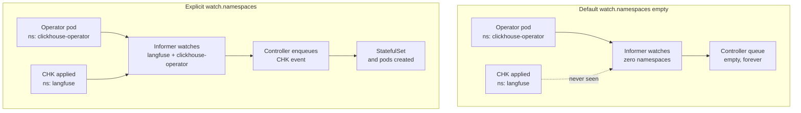

# The Altinity operator that watched nothing

**TL;DR** — I installed the Altinity ClickHouse operator to manage a CHI (ClickHouseInstallation) for our Langfuse backend. The pod was healthy, CRDs Established, RBAC verified with `kubectl auth can-i`. Every CHK / CHI I applied — including the official minimal example from the upstream repo — just sat there with an empty `status` forever. No reconcile events, no errors, no webhooks, nothing. The fix turned out to be a single line of config: `watch.namespaces: [...]` explicitly listed, because the operator's default (`[]`) does not mean "all namespaces" the way every other controller I had used treats it.

---

## Context

Part of a migration: Langfuse was running ClickHouse as the Bitnami subchart, a version that is frozen at 25.2.1 and does not support OAuth against GCS. The plan was to move to the upstream `clickhouse/clickhouse-server:26.3` LTS image, managed by the [Altinity operator](https://github.com/Altinity/clickhouse-operator) via CRDs.

The operator install looked clean:

```bash
helm install clickhouse-operator altinity/altinity-clickhouse-operator \
  --version 0.26.3 -n clickhouse-operator -f 02-values.yaml

# Pod Running 2/2, CRDs Established
kubectl get crd clickhouseinstallations.clickhouse.altinity.com          # Established
kubectl get crd clickhousekeeperinstallations.clickhouse-keeper.altinity.com  # Established
```

Everything I knew to check said the operator was up. I applied a minimal CHK (Keeper):

```yaml
apiVersion: "clickhouse-keeper.altinity.com/v1"
kind: "ClickHouseKeeperInstallation"
metadata:
  name: langfuse-keeper
  namespace: langfuse
spec:
  configuration:
    clusters:
      - name: default
        layout: { replicasCount: 1 }
```

And waited.

---

## The symptom

```
$ kubectl -n langfuse get chk langfuse-keeper
NAME              CLUSTERS   HOSTS   STATUS   AGE
langfuse-keeper                                3m

$ kubectl -n langfuse get chk langfuse-keeper -o jsonpath='{.status}'
# empty

$ kubectl -n langfuse describe chk langfuse-keeper
# no Events at all
```

`generation: 1` on the CR. No status, no events, no StatefulSet created, no child resources, nothing. The operator pod logs were equally unhelpful: only the startup config dump and one line saying *"Starting workers"* for both the CHI and the CHK controllers. No reconcile log, no enqueue log, no error.

The CHK was not being *refused* — it was simply being ignored.

---

## Attempt 1: RBAC

The most common cause of a controller that silently does nothing is RBAC. I checked:

```bash
for verb in get list watch patch update create delete; do
  echo -n "$verb chk: "
  kubectl auth can-i "$verb" clickhousekeeperinstallations.clickhouse-keeper.altinity.com \
    --as=system:serviceaccount:clickhouse-operator:clickhouse-operator -n langfuse
done
# yes yes yes yes yes yes yes
```

All green, at cluster scope and per-namespace. Not RBAC.

---

## Attempt 2: webhooks

Sometimes a broken validating/mutating webhook silently drops CR events before they reach the controller.

```bash
kubectl get validatingwebhookconfigurations
kubectl get mutatingwebhookconfigurations
```

Neither had any entry related to the operator. Not webhooks.

---

## Attempt 3: `ClickHouseOperatorConfigurations` filtering the namespace

The operator has its own CRD for config overrides at runtime. If something had been deployed with `watchNamespaces: [ns1, ns2]`, any namespace not in the list would be silently ignored.

```bash
kubectl get clickhouseoperatorconfigurations -A
# No resources found
```

Nothing. Not a runtime config filter.

---

## Attempt 4: full-minimal reproduction with the upstream example

To eliminate the possibility that my manifest was subtly wrong (though it validated against the CRD schema), I applied the upstream repo's own `docs/chk-examples/01-simple-1.yaml` verbatim.

```bash
kubectl apply -f https://raw.githubusercontent.com/Altinity/clickhouse-operator/master/docs/chk-examples/01-simple-1.yaml
# same outcome: status empty, no reconcile, no events
```

Same silent ignore. Operator was not picking up anything at all.

---

## Attempt 5: downgrade to a different operator version

`0.26.3` had just been released. I tried `0.26.2` — same. At this point I was about to walk down the whole 0.26.x / 0.25.6 matrix when I paused.

---

## The aha moment

The Altinity repo's issue tracker has [#1905 "Operator could not create Keeper Pods"](https://github.com/Altinity/clickhouse-operator/issues/1905) — 24 comments, and the title is misleading. The actual pattern described in the thread is:

> *"If ClickHouseKeeperInstallation is installed to same namespace as operator — then operator successfully creates the keeper pods, etc."*

And further down, the mechanism: the operator's config has a field `watch.namespaces` that defaults to `[]`. In most Kubernetes tooling — `kubectl`, informers, CRD-based controllers — an empty selector means "all". **In this operator's CHK controller, the "empty = all" interpretation is broken when the operator runs in a namespace different from the CR's namespace.** An "empty" list effectively becomes "the operator's own namespace only".

A [related issue #1923](https://github.com/Altinity/clickhouse-operator/issues/1923) addresses part of this and was merged into 0.26.2. But the fix does not cover the symptom reproduced here, as several commenters have confirmed.

The operator was doing exactly what its (buggy) config told it to do: watch zero namespaces. That is why the logs showed workers starting and zero events after: there was nothing to enqueue because nothing was being *informed* in the first place. It was not a reconciliation bug, it was an informer-scope bug. I had been looking at the wrong layer of the controller the whole time.

---

## The solution

Enumerate the namespaces the operator should watch, explicitly, in Helm values:

```yaml
# fast/tenants/macro/7a-clickhouse-operator/02-values.yaml
configs:
  files:
    config.yaml:
      watch:
        namespaces:
          - langfuse            # where the CHI and CHK live
          - clickhouse-operator # the operator's own namespace (harmless but consistent)
        # reason: with watch.namespaces: [] the CHK controller does NOT watch other
        # namespaces when the operator is deployed in a different ns than the CR
        # (upstream issue Altinity/clickhouse-operator#1905). Enumerating fixes it.
```

Applied with `helm upgrade`. Within seconds of the new operator pod coming up, the CHK that had been stuck for an hour went to `status: InProgress` and then `Completed`. The StatefulSet and the Keeper pod appeared. Applying the real CHI right after got the same treatment.

The fix is one line of config, once you know where to look.

---

## Diagram



---

## Takeaways

1. **"Empty list means all" is a dangerous default.** Standard Kubernetes practice says empty = all, but every operator interprets its own config. If a controller has a `watch.namespaces` field and you are running cross-namespace, enumerate the namespaces explicitly. Do not trust `[]`.

2. **The symptom of an informer-scope bug looks identical to the symptom of a broken controller.** Both show zero reconcile events, zero status updates. The difference is which layer of the controller is stuck. Before chasing RBAC, webhooks, or the CR itself, verify the *scope* of what the operator's informer is watching. That is the input to everything else — if nothing enters the informer, nothing reaches the reconciler, and no logs are produced by the reconciler because it was never called.

3. **`kubectl describe` showing zero events is a signal, not a reassurance.** A healthy CR under a working operator usually has at least one `Normal ReconcileStarted` event within seconds. If even that is missing, the controller is not seeing the resource at all.

4. **Read the operator's issue tracker before the docs.** The official docs said `watch.namespaces: []` means "watch all". The issue tracker had the actual behavior. When a setup works by the book and silently does not, the pattern is almost always a known upstream bug that has not been resolved or documented.

5. **Downgrade is cheap, but it doesn't help if the bug is systemic.** I was about to walk the full version matrix (0.26.2, 0.26.1, 0.26.0, 0.25.6). The issue thread saved me 2+ hours: the bug was present across all of them, the workaround was the same everywhere. Search for the *symptom* before burning time on *versions*.

---

## Stack involved

- Altinity ClickHouse operator v0.26.3 ([chart `altinity/altinity-clickhouse-operator`](https://github.com/Altinity/clickhouse-operator/tree/master/deploy/helm/clickhouse-operator))
- CRDs: `ClickHouseInstallation`, `ClickHouseKeeperInstallation`
- GKE private cluster, Dataplane V2 (Cilium)
- Helm 3, operator deployed in its own namespace; CRs in the workload namespace

---

## Links / references

- [Altinity issue #1905 — Operator could not create Keeper Pods](https://github.com/Altinity/clickhouse-operator/issues/1905)
- [Altinity issue #1923 — Keeper: watch.namespaces configuration ignored for CHK](https://github.com/Altinity/clickhouse-operator/issues/1923)
- [Upstream example `01-simple-1.yaml`](https://github.com/Altinity/clickhouse-operator/blob/master/docs/chk-examples/01-simple-1.yaml)
- [Operator config reference — `watch.namespaces`](https://github.com/Altinity/clickhouse-operator/blob/master/config/config.yaml)
