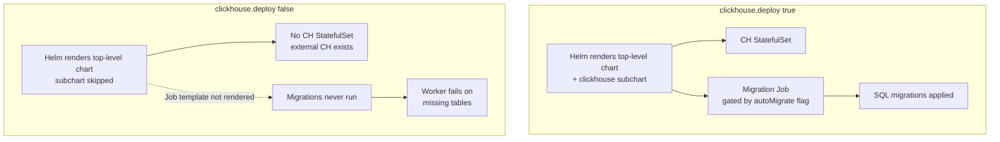

# The Helm chart that does not migrate what it does not deploy

**TL;DR** — I moved Langfuse to an external ClickHouse (upstream LTS image instead of the frozen Bitnami subchart). The Helm upgrade went green, the web pod was healthy, the Prisma migrations against Postgres ran fine. The worker, though, sat in an infinite `ClickHouse traces table does not exist. Retrying in 10s...` loop. The chart has a `clickhouse.migration.autoMigrate: true` flag that is still honored when you set `clickhouse.deploy: false`. It is honored, and it does nothing — because the migration Job the flag gates exists in the subchart that you just disabled. Externalizing a chart dependency is not free: you also inherit whatever lifecycle work the chart used to do for you invisibly.

---

## Context

Langfuse ships a Helm chart that bundles the services it needs as subcharts: Postgres, Redis, ClickHouse, ZooKeeper. In development this is convenient; in production you typically externalize the heavy ones. We were moving ClickHouse out of the chart — from Bitnami `25.2.1` (frozen since Bitnami froze its community images) to the upstream image `clickhouse/clickhouse-server:26.3` running under the Altinity operator.

Values diff (simplified):

```yaml
# before
clickhouse:
  deploy: true
  image: bitnamilegacy/clickhouse
  tag: 25.2.1
  persistence: { size: 5Gi }

# after
clickhouse:
  deploy: false
  host: chi-langfuse-default-0-0.langfuse.svc.cluster.local
  httpPort: 8123
  nativePort: 9000
  auth:
    existingSecret: langfuse-secrets
    existingSecretKey: clickhouse-password
  migration:
    autoMigrate: true      # left as-is; I thought this wired up migrations against the external host
```

`helm upgrade` went clean. The ClickHouse CHI was up and serving on the new host. The web pod rendered `/api/public/health` with the new version. I moved on.

---

## The symptom

Ten minutes later, checking the worker out of habit:

```
$ kubectl logs -n langfuse langfuse-worker-6fb45fffbb-nln8d -c langfuse-worker --tail=20
ClickHouse traces table does not exist. Retrying in 10s...
ClickHouse traces table does not exist. Retrying in 10s...
ClickHouse traces table does not exist. Retrying in 10s...
```

The web looked healthy because the route that returns health does not touch the ClickHouse tables. The worker, which consumes events and writes traces, was the first thing to actually query the database — and it was querying a database that had no schema.

```
$ kubectl exec -n langfuse chi-langfuse-default-0-0-0 -- clickhouse-client -q "SHOW TABLES"
# empty
```

The ClickHouse instance had zero tables. The `autoMigrate` flag was `true`. Nothing had run.

---

## Attempt 1: assume the migration Job is there, I just missed it

```
$ kubectl get jobs -n langfuse | grep -i clickhouse
# nothing

$ kubectl get jobs -n langfuse -o name | xargs -I{} kubectl get {} -o yaml | grep -i migrat
# nothing
```

No Job, no CronJob, no Pod with "migration" in its name. I looked for an initContainer on the worker or web pods:

```
$ kubectl get pod -n langfuse langfuse-web-... -o jsonpath='{.spec.initContainers[*].name}'
# empty
```

No initContainer. The chart, with `autoMigrate: true`, was not creating anything that runs migrations.

---

## Attempt 2: read the chart templates instead of the values schema

I went to `charts/langfuse/templates/` and grepped for the migration flag:

```bash
grep -rn "autoMigrate" charts/langfuse/
# charts/langfuse/charts/clickhouse/templates/...
```

Every hit for `autoMigrate` lived inside the `clickhouse` **subchart** — not in the top-level chart. The top-level chart does nothing with `clickhouse.migration.autoMigrate`. It is read by the subchart and wired to a migration Job that ships as part of the subchart's templates. When you set `clickhouse.deploy: false`, Helm does not render anything from the subchart — including the Job.

The flag is not ignored. It is read by code that is no longer instantiated. From the values perspective, nothing changed: the key still exists, its value is still `true`, and Helm does not warn you that it now has zero effect.

---

## The aha moment

When you externalize a subchart dependency, you move more than the compute — you also strip out whatever lifecycle management the subchart was quietly running. Migrations, init containers, bootstrap jobs, post-install hooks — anything that ran in the space of the disabled subchart is gone.

The Langfuse chart's ClickHouse subchart owned:
- deploying ClickHouse,
- creating its ServiceAccount and SA-to-SA Workload Identity binding,
- running the schema migrations on install and on upgrade,
- attaching TTL settings to system tables.

When I set `clickhouse.deploy: false`, I absorbed the responsibility for every one of those. The chart does not track "the user has externalized me, here are the things I used to do for you". It just renders nothing.

`autoMigrate: true` being honored made the trap harder to see. If the values schema had been strict and had told me *"this field requires `clickhouse.deploy: true`"*, I would have noticed on the dry-run. Instead the field silently became inert and the failure only surfaced when traffic hit the worker.

---

## The solution

Langfuse ships the migration scripts inside the web and worker images. They're a set of SQL files under `/app/packages/shared/clickhouse/migrations/unclustered/` plus a `go-migrate` runner wrapper:

```bash
WEB_POD=$(kubectl -n langfuse get pod -l app.kubernetes.io/component=web \
  -o jsonpath='{.items[0].metadata.name}')

kubectl -n langfuse exec "$WEB_POD" -c langfuse-web -- \
  sh -c 'cd /app/packages/shared && sh clickhouse/scripts/up.sh'
```

34 migrations ran in about 20 seconds, creating `traces`, `observations`, `scores`, `event_log`, `dataset_run_items`, and the other tables the worker and the web API expect. Within a second of the last migration finishing, the worker's retry loop exited on its own and went to `[Background Migration] No background migrations to run`.

To make this automatic on every future helm upgrade, I added a phase to our deploy script:

```bash
# fast/tenants/macro/7-deploy-langfuse/03-deploy.sh  (Phase 5.5)
echo ">> Running ClickHouse schema migrations against external CH"
kubectl -n langfuse wait --for=condition=Ready pod \
  -l app.kubernetes.io/component=web --timeout=5m

WEB_POD=$(kubectl -n langfuse get pod -l app.kubernetes.io/component=web \
  -o jsonpath='{.items[0].metadata.name}')
kubectl -n langfuse exec "$WEB_POD" -c langfuse-web -- \
  sh -c 'cd /app/packages/shared && sh clickhouse/scripts/up.sh'
```

Idempotent (`go-migrate` tracks a `schema_migrations` table inside ClickHouse itself), so it is safe to run on every upgrade. On a no-op it prints `no change` and exits.

---

## Diagram



Setting `deploy: false` on a subchart silently removes every template it owned, including the one the parent was relying on.

---

## Takeaways

1. **Helm values can be silently conditional.** A flag that is "valid" when read by one rendered template might have no effect when that template is not rendered. If a chart splits responsibilities between a parent and a subchart and you disable the subchart, re-read the parent templates to see which values the parent itself does anything with.

2. **Externalizing a dependency is inheriting its ops.** Migrations, cron jobs, bootstrap hooks, secrets wiring — any of these may live inside the subchart you just disabled. List every template the subchart provided. Pick up the ones you still need.

3. **A green `helm upgrade` is not an end-to-end signal.** The release went `deployed`, the web pod was `Ready`, all pods converged. The actual data-plane contract — the worker being able to write to the database — was broken. Healthy does not mean functional when the health check doesn't touch the broken thing.

4. **A retry loop with a clear error message is a gift.** The worker logged *"ClickHouse traces table does not exist"* on every attempt. That literally named the missing resource and the database it was expected in. Any retry loop that just says `failed to connect` or `error in worker` would have hidden the problem for much longer.

5. **Make the fix idempotent and bake it into the deploy.** Running migrations manually every upgrade is fragile: sooner or later someone forgets. A `sh up.sh` that is idempotent and safe to run as a Phase 5.5 step in the deploy script is a cheap insurance policy. The phase takes ~3 seconds on a no-op and 20 on a real migration.

---

## Stack involved

- Langfuse Helm chart v1.5.20
- ClickHouse upstream `clickhouse/clickhouse-server:26.3` (externalized, managed by Altinity operator)
- `go-migrate` runner packaged inside the Langfuse web/worker images
- GKE private cluster

---

## Links / references

- [Langfuse chart values reference](https://github.com/langfuse/langfuse-k8s)
- [`go-migrate` used by Langfuse for CH schema](https://github.com/golang-migrate/migrate)
- Related war story #13 — [The Altinity operator that watched nothing](./13-altinity-operator-watch-namespaces.md) (the migration that got us to this situation in the first place)
