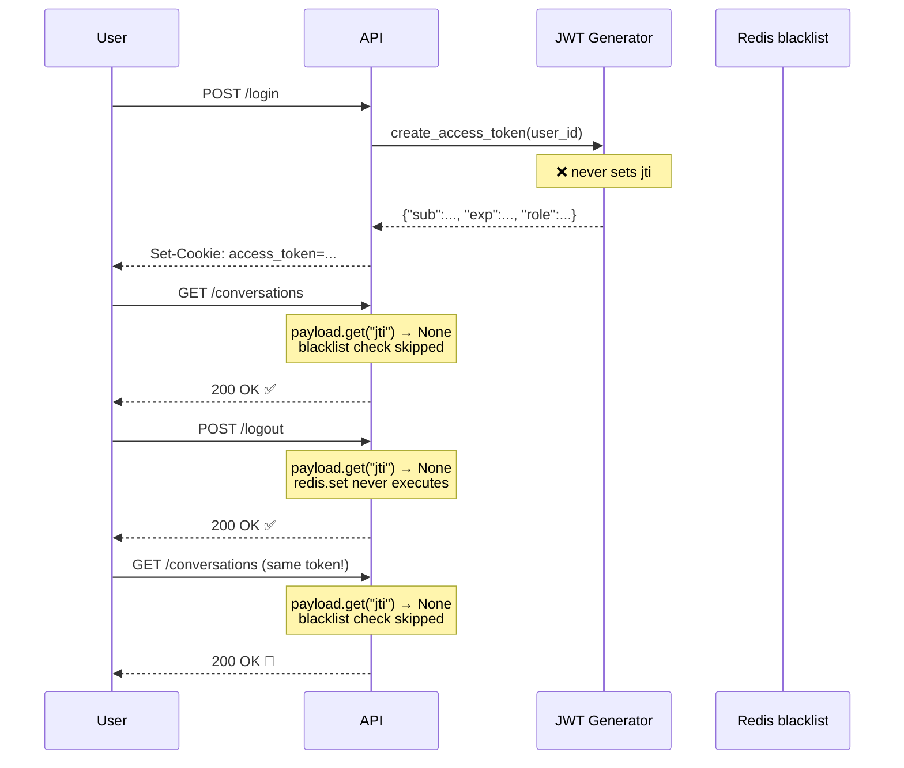

# The JTI claim that wasn't there — dead code that passed code review

**TL;DR** — A second-round audit reported "access token survives logout". We added Redis-backed JWT revocation: blacklist on logout, check on every request. SAST clean, code review approved, two senior engineers signed off. End-to-end: login → use token → logout (200 OK) → reuse the **same** token → 200 OK. The fix did nothing. Root cause: the JWT generator never emitted a `jti` claim, so `payload.get("jti")` was always `None`, and the blacklist write was unreachable. Three components in a security chain — generator, store, check — and we silenced the first one without noticing.

---

## Context

Banking RAG platform. JWT-based auth with HTTPOnly cookies, 15-minute access tokens. The first audit round reported a known limitation: stateless JWTs cannot be revoked before their `exp`. The standard mitigation is a `jti` claim plus a Redis blacklist with TTL.

The team implemented it across two PRs:
- PR A: add JTI revocation **read** in `dependencies.get_current_user` (block requests whose `jti` is in `token:revoked:*`).
- PR B: add JTI revocation **write** in `auth.logout` (push the JTI into Redis with TTL = `exp - now`).

Both PRs went green. Both got reviewed. The second-round audit a few weeks later flagged "access token survives logout" as still **open**.

---

## Attempt 1: assume the auditor is wrong, run grep

The first reaction was annoyance. Both pieces of code existed. Let me show you they exist:

```python
# src/infrastructure/api/dependencies.py — PR A
jti = payload.get("jti")
if jti:
    revoked = await redis.exists(f"{_REVOKED_JTI_PREFIX}{jti}")
    if revoked:
        raise AuthenticationError(message="Token has been revoked.")
```

```python
# src/infrastructure/api/v1/auth.py — PR B (logout)
if access_token:
    try:
        payload = decode_access_token(access_token)
        jti = payload.get("jti")
        if jti:
            remaining_ttl = int(payload.get("exp", 0) - time.time())
            if remaining_ttl > 0:
                await redis.set(f"{_REVOKED_JTI_PREFIX}{jti}", "1", ex=remaining_ttl)
    except Exception:
        pass
```

Both files are exactly what you expect. The auditor must be wrong. We know how this looks from the code.

**Result**: nothing about this `grep` proved anything about runtime.

---

## Attempt 2: run the actual attack

Burned by getting fooled by AI auditors before (see story 17), we ran the PoC end-to-end against the deployed system in QA:

```bash
# 1. Login → capture token
TOKEN=$(curl -s -i -X POST $API/api/v1/auth/login \
  -d '{"email":"...","password":"..."}' \
  | grep -i "set-cookie: access_token=" \
  | sed -E 's/.*access_token=([^;]+).*/\1/' | tr -d '\r')

# 2. Pre-logout: confirm the token works
curl -s -o /dev/null -w "Pre-logout: %{http_code}\n" \
  $API/api/v1/conversations -H "Cookie: access_token=$TOKEN"
# → Pre-logout: 200 ✅

# 3. Save a copy (simulate attacker who already has the token)
TOKEN_STOLEN="$TOKEN"

# 4. Logout
curl -s -o /dev/null -w "Logout:      %{http_code}\n" \
  -X POST $API/api/v1/auth/logout -H "Cookie: access_token=$TOKEN"
# → Logout:      200 ✅

# 5. Reuse the same token — DEBE fallar
curl -s -o /dev/null -w "Post-logout: %{http_code}\n" \
  $API/api/v1/conversations -H "Cookie: access_token=$TOKEN_STOLEN"
# → Post-logout: 200 🚨
```

The token kept working after logout. The auditor was right. The code we shipped did not do what we thought it did.

---

## The aha moment

We decoded the JWT payload to look at it, expecting to find `jti` somewhere:

```bash
echo "$TOKEN" | cut -d. -f2 | tr '_-' '/+' | base64 -d
# {"sub":"1000","exp":1777471535,"iat":1777470635,"role":"admin","roles":["gsi"]}
```

No `jti` claim. None.

Suddenly the logout code becomes a haiku of failure:

```python
jti = payload.get("jti")   # → returns None, every time
if jti:                     # → False, every time
    await redis.set(...)    # → never executes
```

The check in `dependencies.py`:

```python
jti = payload.get("jti")   # → also None
if jti:                     # → also False
    revoked = await redis.exists(...)
```

Three components form the security chain:

```
1. JWT generator embeds `jti` →  2. logout writes `jti` to Redis →  3. check on each request
       ❌ FALTA                       ✅ implementado                  ✅ implementado
```

We had built parts 2 and 3 but never part 1. Without part 1, parts 2 and 3 are inert — they never have anything to operate on. The blacklist in Redis is empty forever. Every check returns "not in blacklist, proceed". The system behaves identically to one with no revocation logic at all.

The lesson is harder than "we forgot a feature". We had:

- Two PRs, each individually correct in scope.
- Two code reviews, both lucid.
- SAST passing.
- Unit tests passing on each isolated component.

What was missing: an **integration test that exercises the full chain end-to-end with the actual generator/store/check from the deployed system**. Each component, tested in isolation, was correct. The connection between them was the bug.

---

## The solution

### Fix the generator

```python
# src/infrastructure/security/jwt.py
import secrets

def create_access_token(user_id: int, role: str, roles: list[str]) -> str:
    now = int(datetime.utcnow().timestamp())
    payload = {
        "sub": str(user_id),
        "exp": now + ACCESS_TOKEN_EXPIRE_MINUTES * 60,
        "iat": now,
        "jti": secrets.token_urlsafe(16),   # ← THE MISSING PIECE
        "role": role,
        "roles": roles,
    }
    return pyjwt.encode(payload, settings.jwt_secret.get_secret_value(), algorithm="HS256")
```

After deployment, decoded JWT shows what we wanted from the start:

```json
{"sub":"1004","jti":"a355dfae62d12d89ed02317629a67784","exp":...,"iat":...,"role":"user","roles":["consulta"]}
```

Re-running the PoC: post-logout request now returns `401 "Token has been revoked."` instead of `200 OK`.

### Add the integration test

The deeper fix. Pin **the full chain** with a single test, not three isolated ones:

```python
# tests/integration/test_logout_revokes_access_token.py
async def test_access_token_revoked_after_logout(client, redis):
    # 1. Login
    r = await client.post("/api/v1/auth/login", json={...})
    assert r.status_code == 200
    token = r.cookies["access_token"]

    # 2. Token works
    r = await client.get("/api/v1/conversations", cookies={"access_token": token})
    assert r.status_code == 200

    # 3. Logout
    r = await client.post("/api/v1/auth/logout", cookies={"access_token": token})
    assert r.status_code == 200

    # 4. The exact same token must now be rejected
    r = await client.get("/api/v1/conversations", cookies={"access_token": token})
    assert r.status_code == 401
    assert "revoked" in r.json()["error"]["message"].lower()
```

This test would have failed on day one. It uses the real generator, the real store, the real check. The chain has a single failure mode and the test asserts on the chain end-to-end.

---

## Diagram



---

## Takeaways

1. **Static analysis sees syntax. Defense lives in runtime.** SAST cannot tell you that a function returns `None` against an unfortunately-named key. Even modern type checkers do not catch this — `dict.get` legitimately returns `None`.
2. **Security chains demand chain tests.** When defense requires N components in series, write a single test that exercises all N together with the real implementations. Three unit tests proving each isolated component is correct does not prove the system is secure.
3. **Write the attack before you write the fix.** For every security defense, write an integration test that demonstrates the bug existing **before** the fix. If the test does not turn red pre-fix, the fix is doing nothing — and you have just learned that without paying for it in production.
4. **`get` with default is a smell in security paths.** `payload.get("jti")` silently tolerates a missing claim. In an authorization context, the safer pattern is `payload["jti"]` and let it raise — or explicitly fail closed:
   ```python
   jti = payload.get("jti")
   if not jti:
       raise AuthenticationError(message="Token missing jti claim — refusing.")
   ```
5. **Code review is necessary but not sufficient.** Two senior engineers approved both PRs. The bug was inter-PR — the connection between two correct pieces. Reviewers cannot keep the full system in working memory. Tests can.

---

## Stack involved

- PyJWT 2.x with HS256 signing (separate finding — see audit notes)
- Redis 7 for the JTI blacklist (`SET <key> "1" EX <ttl>`)
- FastAPI + dependencies
- pytest-asyncio for the integration test

---

## Links / references

- [RFC 7519 §4.1.7 — `jti` claim](https://datatracker.ietf.org/doc/html/rfc7519#section-4.1.7)
- [OWASP Cheat Sheet — JWT](https://cheatsheetseries.owasp.org/cheatsheets/JSON_Web_Token_for_Java_Cheat_Sheet.html)
- [CWE-613 — Insufficient Session Expiration](https://cwe.mitre.org/data/definitions/613.html)
