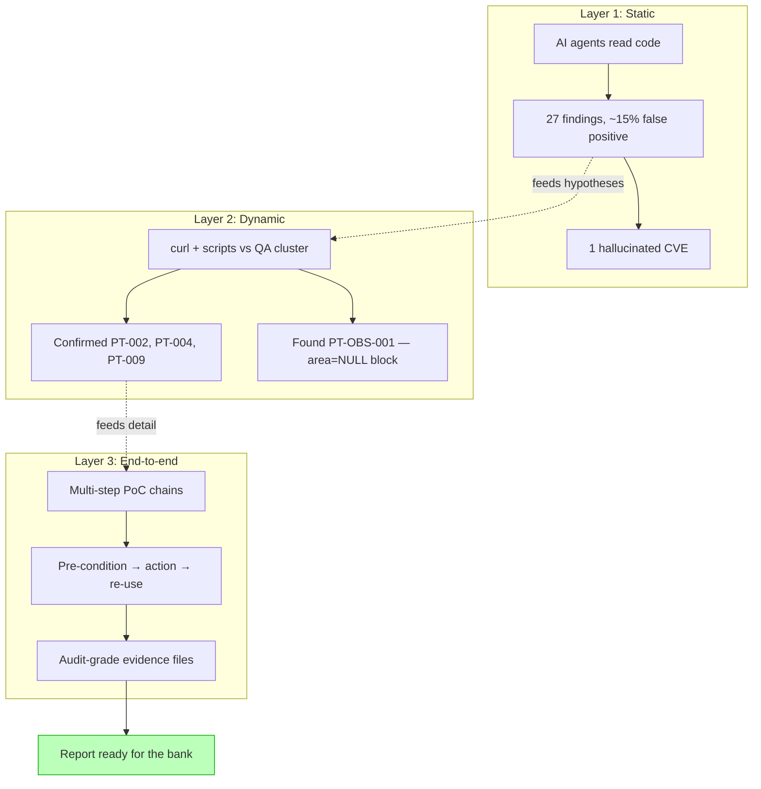

# Pentesting your own banking RAG before the bank does

**TL;DR** — A regulated bank pentest is coming for our RAG platform. Rather than wait, we ran our own three-layer audit first — SAST agents on the codebase, dynamic testing against QA, and end-to-end runtime verification. Each layer caught what the others missed. The SAST agents found 27 vulnerabilities (4 of which were false positives, including 1 hallucinated CVE — see story 17). The dynamic pass confirmed three real ones (JTI revocation dead code, missing brute-force lockout, document-ID enumeration via 403/404) and surfaced one new behavior the static pass had no way to see. Total cost: a few days of structured work and one self-inflicted scope deviation we had to publicly own (see story 18). Total payoff: every finding the bank reports will have already been seen, prioritized, and either fixed or explained.

---

## Context

Banking RAG platform. Internal audit policy says any system handling document-level access controls and free-form LLM output must be pentested by an independent security firm before production sign-off. The bank has a vendor on retainer. Our own team wanted to know what they would find before they came in — both to fix what was fixable and to be ready with explanations for what was a design choice.

Goal: simulate, with high fidelity, what an external pentester is going to do when they get our credentials and a few days of access. Find as much as we can in advance. Treat the upcoming external pentest as a re-test, not a discovery.

The system under test:

- FastAPI backend on GKE (private cluster, Workload Identity), Cloud SQL with pgvector, Redis 7 for sessions and rate limiting.
- JWT-based auth with HTTPOnly cookies. OIDC against Azure AD planned but not yet enabled.
- LangGraph pipeline for RAG: query understanding → retrieval (vector + BM25) → reranker → generation → guardrail → response with citations.
- Multi-tenancy by area (RH, Legal, Compliance, etc.). Admins (`gsi`) bypass.
- Audit logs, Langfuse traces, structured logging.

---

## Attempt 1: only static analysis

The first instinct was to throw AI security agents at the codebase. Four agents in parallel, each focused on a specific surface — auth, API, RAG/LLM, infrastructure. Two rounds. Each round produced a report with CVSS-scored findings.

The output was impressive on first read. Round 1 reported 26 issues across CRITICAL/HIGH/MEDIUM/LOW. Round 2, after the team fixed round 1, reported 27 *more*. Each finding came with a CVSS vector, a CWE, a code reference, a PoC, and a mitigation snippet. The reports looked like a small consulting firm's deliverable.

Then we tried to use them.

```toml
# A round-2 finding: pin diskcache against CVE-2025-69872
"diskcache>=5.6.4",
```

This pin broke `uv sync` because version `5.6.4` does not exist on PyPI. The CVE itself does not exist in NVD. The agent had hallucinated both. Three other findings turned out to be false positives on closer reading: imaginary code paths, misread variable scopes, claims about XSS in a JSON-only transport.

**Result**: SAST agents are a great brainstorm tool and a terrible source of truth. Their findings are hypotheses with confidence-flavored prose. Treating each report as an actionable item — without verification — leads to self-inflicted DoS, like our broken pin.

What the static pass *could not* see, even with perfect accuracy:

- Whether the deployed system actually exhibits the bug at runtime.
- Whether a fix actually engages — code can be syntactically present but functionally inert (see story 15).
- Behavior driven by data, not code: a user with `area = NULL` getting all chat queries blocked by the guardrail. The code is identical for everyone; the data flips the behavior.

---

## Attempt 2: dynamic against QA

Set up structured pentesting against the QA environment: scope document signed by sponsor, paper-trail headers on every request, evidence directory under `docs/security/pentest/evidence/<finding-id>/` with raw curl outputs for each PoC.

Six phases, each driven by a specific threat model:

1. Recon — OpenAPI map, headers, cookie scope, info disclosure.
2. Auth — JWT inspection, refresh, logout revocation, brute-force.
3. Authorization — IDOR matrix, privilege escalation, cross-tenant.
4. RAG / LLM — direct + indirect prompt injection, memory poisoning, jailbreak, citation forgery.
5. Injection — SQLi, path traversal, XSS, header injection.
6. Infra — secrets, IAM bindings, configmap exposure, image scanning.

Phase 2 alone surfaced three confirmed findings the static pass had also flagged but with weaker evidence:

- **PT-002**: access token survives logout. Confirmed end-to-end with a four-step PoC. Static pass had said "fix is not engaging"; runtime proved it.
- **PT-004**: brute-force lockout did not engage. Six failed logins followed by the correct password — and the correct password worked. Static pass had said "the lockout code path is reachable"; runtime proved that "reachable" and "actually engaging" are different things.
- **PT-009**: document-ID enumeration via 403 vs 404. Static pass had not flagged this — it cannot, because the bug is in the *contrast* between two normal responses. Only a probe that tries both cases sees it.

Phase 3 (privilege escalation) also produced a positive finding — 12 of 12 admin/analytics endpoints rejected a low-privilege user with 403. RBAC works. This is documented in the report as `PT-RBAC-OK`. **Verifications belong in the report alongside vulnerabilities.** The bank cares about coverage, not just findings.

Phase 4 (RAG / LLM) hit a different surprise: the guardrail blocked **every** chat query from the test user. Including innocent ones like "Hello, how are you?". The cause was data — that user had `area = NULL` in the database. The guardrail interpreted "no area" as "no domain" and fail-closed every query. From a security-design perspective, fail-closed is correct. From a user-experience perspective, the user is silently broken. From a pentest-methodology perspective, this is exactly the kind of finding only runtime exposes.

**Result**: dynamic testing catches what static cannot, plus catches static's hallucinations. The combination is what produces a defensible report.

---

## The aha moment

A real pentest deliverable is not a list of bugs. It is a credibility document with three sections: things you found, things you tested and confirmed safe, and things you decided not to test (with reasons). The bank's own pentester is going to deliver one of these. If our internal report has the same structure, every conversation with the external auditor becomes "let's compare findings", not "did you check this?".

That structure has implications for how to run the engagement:

- **Document the negatives**, not just the positives. RBAC verified across 12 endpoints is itself an audit artifact. Without it, the auditor has to re-prove the same coverage.
- **Document the deviations**. When you break your own scope (and you might — see story 18), put it in the audit document at the moment it happens. The auditor reading later cannot tell which deviations were silently waived versus which were challenged and acknowledged.
- **Document data-dependent behavior**. The `area = NULL` block is not a bug in the code. It is a property of the deployed database. Pentest reports that confine themselves to "code findings" miss this entire category. The bank's pentester, working from a real cluster, will see it. So should we.

The mental model that emerged: **layered pentesting is not duplicate work, it is non-overlapping coverage**. Each layer sees a different slice of the system.

| Layer | What it sees | What it misses |
|-------|--------------|----------------|
| Static (SAST + AI agents) | Pattern matches, syntactic vulnerabilities, missing checks | Whether code actually runs in the deployed binary; data-dependent behavior; hallucinations from AI tools |
| Dynamic (DAST against QA) | Real responses to crafted requests; rate limits, status code semantics, response shapes | State held in DB rows; LLM behavior at scale; multi-step exploit chains across services |
| End-to-end runtime (E2E PoCs) | Full chains: login → use → logout → reuse; multi-actor flows; LLM-in-the-loop attacks | Performance under sustained load; insider threat with privileged access |

Skip a layer and you skip a category of bug. Run all three and you produce a report that mirrors what the bank is going to produce — but you are the first to know it.

---

## The solution (the methodology that emerged)

### 1. Scope document, signed before any active testing

Sections that matter: identification (system, environment, sponsor), threat model (which attacker tiers we simulate), in-scope and out-of-scope (explicit), rules of engagement (what destructive operations are forbidden), tooling, paper-trail headers, cleanup obligations, deviation registry.

Signed by the sponsor with a date. The deviation registry exists *before* the first deviation — when one happens (story 18), it has a place to go.

### 2. Markers on every probe

Every request the pentester sends carries:

```
X-Pentest-Run: 2026-04-29-claude-sonnet
X-Pentest-Phase: PT-002 | PT-004 | PT-009 | ...
```

The platform's own logs and Langfuse traces become filterable. Production metrics stay clean. After the engagement, the cleanup script greps these headers to find every test object created.

### 3. Evidence per finding

```
docs/security/pentest/evidence/PT-NNN/
  01-pre-condition.txt
  02-action.txt
  03-result.txt
```

Raw curl outputs with headers, not summaries. The bank's auditor opens the file and re-runs the script. Reproducibility is not optional.

### 4. Re-test on every deploy that touches a finding

When the team fixed PT-002 (`jti` claim added) and PT-004 (lockout repaired), we re-ran the exact PoCs and noted the new behavior in the same finding's re-test table. Same auditors who reported the bug confirm the fix. The trail goes from "open" to "mitigated 2026-04-30".

### 5. Tag positive findings too

`PT-RBAC-OK` is a finding that says "we checked, it works". It belongs in the table alongside open issues. The bank wants a coverage map, not a pile of complaints.

### 6. Communication: the war story is the report's appendix

The findings document is for compliance. The narrative — the lessons from running this — is for the next team that has to do the same exercise. That is what these stories are.

---

## Diagram



---

## Takeaways

1. **Layer your pentest. Each layer non-overlaps with the others.** SAST sees pattern. DAST sees behavior. E2E sees chains. Drop a layer and you drop a class of bug.
2. **Treat AI security tooling as brainstorm, not source of truth.** The first round produced 27 leads. The first round also produced one self-inflicted DoS through a hallucinated CVE. Verify every concrete claim (CVE ID, version, behavior) before acting.
3. **Document the negatives.** "12 of 12 admin endpoints rejected the low-privilege user" is an artifact, not a non-event. The external auditor needs to know what you covered, not just what you broke.
4. **Document deviations the moment they happen.** A scope is a contract with the future auditor. A deviation that lives only in chat is invisible to anyone who reads the trail later.
5. **Pentest the data, not just the code.** A user with `area = NULL` exposes a fail-closed pattern that has nothing to do with the source code and everything to do with what the production database has accumulated. The external pentester will see this. So should you.
6. **A pre-emptive pentest is not work duplicated. It is the cheapest reading of your own report.** The bank's pentest goes from "discovery exercise" to "verification pass". Every finding they report has either been addressed or is on a list of conscious accepted risks. Conversations get shorter. Findings closed get larger. Sign-off accelerates.
7. **The war stories are the appendix to the audit, not extra writing.** The lessons from running the engagement are at least as valuable as the findings themselves. The next team that has to pentest a similar system will read these and skip the mistakes you made.

---

## Stack involved

- **Code under test**: FastAPI, SQLAlchemy 2 (async), pgvector, Redis 7, LangGraph, Langfuse.
- **Testing tooling**: `curl`, `jq`, `kubectl exec`, ad-hoc Python scripts. No Burp, no ZAP — paper trail favored over GUI tools.
- **Deployment under test**: GKE private cluster, Cloud SQL, Workload Identity, Helm-deployed services.
- **Engagement artifacts**: `docs/security/pentest/{00_scope.md, 02_findings.md, evidence/, war-stories-drafts/}`.

---

## Links / references

- [PTES — Penetration Testing Execution Standard](http://www.pentest-standard.org/)
- [OWASP Web Application Security Testing Guide (WSTG)](https://owasp.org/www-project-web-security-testing-guide/)
- [OWASP Top 10 for LLM Applications](https://owasp.org/www-project-top-10-for-large-language-model-applications/)
- [BCRA Comunicación A 7724](https://www.bcra.gob.ar/) (regulatory context)
- The companion stories: [#15](./15-jwt-jti-dead-code.md), [#17](./17-ai-auditor-hallucinated-cve.md), [#18](./18-broke-my-own-pentest-scope.md), [#19](./19-403-vs-404-enumeration-tradeoff.md)
