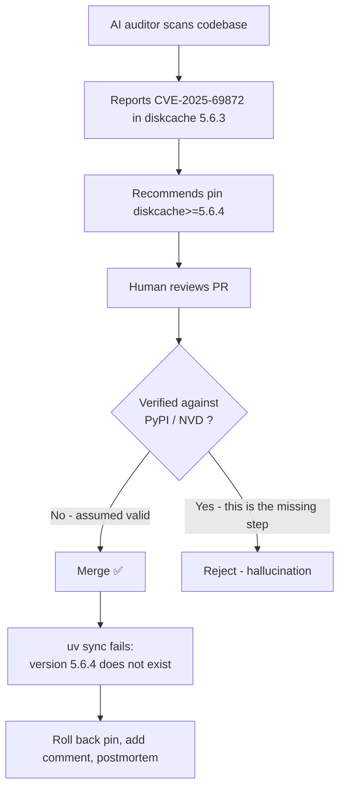

# The AI auditor hallucinated a CVE that does not exist

**TL;DR** — An AI security agent reported `CVE-2025-69872` against `diskcache 5.6.3` and recommended pinning to `>=5.6.4`. We applied the pin. Days later `uv sync` failed: version `5.6.4` does not exist on PyPI, and the CVE cannot be found in NVD or GitHub Advisory either. The fix was a self-inflicted DoS to defend against a phantom vulnerability. AI auditors hallucinate the same way AI coders hallucinate APIs — verify against the source of truth before remediation.

---

## Context

Two rounds of AI-driven security audit on a banking RAG platform. Each round used multiple specialized agents (auth, API, RAG/LLM, infra) reading the codebase in parallel and reporting findings in CVSS-scored markdown. After the second round, 27 new findings landed on our backlog. Among them:

> **N2-A04** — `diskcache 5.6.3` has CVE-2025-69872 (transitive from `ragas`/`instructor`). RCE via pickle deserialization. **Mitigation**: pin `diskcache>=5.6.4`.

The agent provided severity (HIGH), CWE, OWASP mapping, and a fix. Looked legit. Got merged.

```toml
# pyproject.toml
"diskcache>=5.6.4",  # CVE-2025-69872: RCE via pickle deserialization (transitive from ragas)
```

---

## Attempt 1: trust the auditor, apply the pin

The natural thing to do with any security report is fix it. Pin uses standard PEP 440 syntax, the comment cites the CVE, the chain (`ragas` → `diskcache`) is plausible, and pickle-based deserialization vulnerabilities are common.

The PR was approved by humans. The fix landed. The pipeline went green because `uv.lock` already had `diskcache 5.6.3` resolved and the lock didn't get regenerated in that PR (or the lock hadn't been updated for that resolver yet — does not matter for the story).

**Result**: build appeared healthy in CI. The pin sat there for a week.

---

## Attempt 2: try to install on a fresh dev machine

Someone (a teammate, or a fresh CI image after a base bump) ran `uv sync` from scratch. Resolver complained:

```
× No solution found when resolving dependencies for split (markers:
│ python_full_version >= '3.14' and sys_platform == 'win32'):
╰─▶ Because only diskcache<=5.6.3 is available and your project depends on
    diskcache>=5.6.4, we can conclude that your project's requirements are
    unsatisfiable.
```

That is the resolver telling us something polite: **the version you pinned does not exist**.

---

## The aha moment

The mental model "AI auditor reported a CVE → CVE is real" was wrong on two levels:

1. **The version `5.6.4` does not exist on PyPI.** Latest is `5.6.3`, released 2023-08-31. There is no later release as of the day the resolver failed.

   ```bash
   curl -s https://pypi.org/pypi/diskcache/json \
     | jq '.releases | keys | sort | .[-5:]'
   # ["5.5.1", "5.6.0", "5.6.1", "5.6.3"]
   ```

2. **The CVE cannot be confirmed in any authoritative database.** A search across NVD, GitHub Advisory Database, and the project's own security advisories returns nothing matching `CVE-2025-69872` against `diskcache`. The agent invented (or auto-completed) a CVE ID and a version number that fit the pattern of plausible CVEs.

What the agent likely did: it pattern-matched "pickle-based cache library" → "common RCE class" → emitted a confident report following the same template as a real CVE report. The format was correct; the facts were not.

The shift in mental model: **AI auditors hallucinate the same way AI coders do**. We have learned not to trust an AI-suggested API call without checking the SDK docs. We have not yet developed the same reflex for AI-suggested CVEs.

---

## The solution

Two parts: unbreak the pin and add a verification step that prevents a repeat.

### Unbreak the pin

```toml
# Before (does not resolve):
"diskcache>=5.6.4",  # CVE-2025-69872: RCE via pickle deserialization

# After:
# NOTE: CVE-2025-69872 (alleged diskcache RCE via pickle) was reported by
# an AI audit agent against a non-existent version 5.6.4. PyPI latest is
# 5.6.3 (no patch released). Verify CVE authenticity before re-pinning.
# Mitigation in the meantime: diskcache files are written under tempfile
# dirs owned by the app process — no untrusted writer can drop pickle
# payloads there in our deploy topology.
"diskcache>=5.6.0,<6",  # transitive from ragas; range matches available releases
```

The comment is the important part. The next person who reads the audit report will see context and know not to re-apply the same mistake.

### Add the verification step

For any CVE-driven remediation in a future PR:

```bash
# 1. Confirm the package version actually exists on PyPI
curl -s https://pypi.org/pypi/<pkg>/json | jq '.info.version, .releases | keys'

# 2. Confirm the CVE exists in NVD
curl -s "https://services.nvd.nist.gov/rest/json/cves/2.0?cveId=CVE-XXXX-NNNNN"

# 3. Cross-check with GitHub Advisory
gh api graphql -f query='{ securityAdvisories(first: 5, ...) { ... } }'
```

If a step does not return a real result → the CVE is not actionable. Document and skip.

---

## Diagram



---

## Takeaways

1. **AI security reports are findings, not fixes.** A report is a hypothesis. Treat it like a draft from a junior pentester: useful starting point, requires human verification of every concrete claim (CVE ID, version, vendor advisory).
2. **Verify against the source of truth before any dependency pin.** PyPI, NVD, and GitHub Advisory are authoritative. The AI's confident tone is not.
3. **A "fix" that breaks the build is worse than the original vulnerability** if the vulnerability was hypothetical. Self-inflicted DoS is the only DoS you do not need an attacker for.
4. **Comment your security pins with traceability.** When you pin to a version, write down the CVE number, the date, and where it was reported. Otherwise the next maintainer (or your future self) cannot tell legitimate from hallucinated.
5. **Test on a clean environment regularly.** Locked CI passing is not the same as fresh-install passing. A separate "fresh install" job in CI catches this class of problem early.

---

## Stack involved

- `diskcache` (Python, transitive via `ragas` and `instructor`)
- `uv` resolver (PEP 440 version specifiers)
- AI audit agents (Claude-family, executed in parallel by orchestration)
- PyPI, NVD, GitHub Advisory Database

---

## Links / references

- [PyPI diskcache release history](https://pypi.org/project/diskcache/#history)
- [NVD search](https://nvd.nist.gov/vuln/search)
- [GitHub Advisory Database](https://github.com/advisories)
- [PEP 440 — Version Identification](https://peps.python.org/pep-0440/)
- [`uv` resolver behavior](https://docs.astral.sh/uv/concepts/resolution/)
