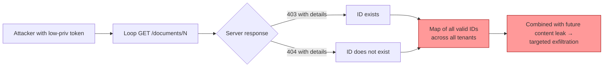

# 403 vs 404 — when better UX leaks your tenant boundary

**TL;DR** — A document endpoint did the "right" thing for UX: returned `403 Forbidden` when the document existed but the user could not see it, and `404 Not Found` when the ID did not exist at all. Two distinct codes, two distinct error messages, both helpful. From a user's perspective. From an attacker's perspective, this is enough to enumerate every document ID in the system without ever reading a single document body. In a multi-tenant banking platform with regulatory area separation ("Chinese walls"), distinguishability is the bug, not the feature.

---

## Context

Banking RAG platform. Documents are tagged with an `area` (RH, Legal, Compliance, etc.). Users belong to one area and can only retrieve documents from their own. Admins (`gsi`) see all areas. The architecture is correct — the user-area filter is wired up everywhere, the listing endpoint correctly returns 0 documents to a low-privilege user from a different area.

The endpoint under test:

```
GET /api/v1/documents/{document_id}
```

The intuitive implementation, the kind that emerges from a clean code review:

```python
@router.get("/{document_id}")
async def get_document(document_id: int, user = Depends(get_current_user)):
    doc = await repo.get_by_id(document_id)
    if not doc:
        raise NotFoundError(message=f"Document {document_id} not found.")
    if not user_can_access(doc, user):
        raise ForbiddenError(message="You don't have permission to access this document.",
                             details={"document_id": document_id})
    return doc
```

Each branch returns a clean, specific message. A user with a missing ID sees "not found". A user with a real ID they cannot reach sees "forbidden". UX-wise this looks great — the user knows the difference between "the link is broken" and "you do not have access to it".

---

## Attempt 1: the standard tenant test

Pentesting the multi-tenancy. Logged in as a user from area `cat`, asked the listing endpoint:

```bash
curl $API/api/v1/documents -H "Cookie: access_token=$TOKEN_CAT"
# {"items": [], "total_count": 0, ...}
```

Zero items. Multi-tenancy works at the listing level. Good.

Then, knowing from the admin user that document `5878` exists in area `general`, asked for it directly as `cat`:

```bash
curl $API/api/v1/documents/5878 -H "Cookie: access_token=$TOKEN_CAT"
# 403
# {"error":{"code":"FORBIDDEN",
#   "message":"You don't have permission to access this document.",
#   "details":{"document_id":5878}}}
```

Cat cannot read the document. Multi-tenancy holds at the per-document level too. Good.

Then asked for an ID that does not exist:

```bash
curl $API/api/v1/documents/99999999 -H "Cookie: access_token=$TOKEN_CAT"
# 404
# {"error":{"code":"NOT_FOUND",
#   "message":"Document 99999999 not found.",
#   "details":{"document_id":99999999}}}
```

Different code. Different message. Different `error.code`. Both responses helpful.

**Result**: two distinct, easily-distinguishable replies for "exists, not yours" vs "does not exist".

---

## Attempt 2: turn it into enumeration

If a single response distinguishes the two cases, then a script that runs against every ID can map the existence space:

```bash
for id in 5870 5871 5872 5873 5874 5875 5876 5877 5878 5879 5880; do
  CODE=$(curl -s -o /dev/null -w "%{http_code}" \
    $API/api/v1/documents/$id -H "Cookie: access_token=$TOKEN_CAT")
  echo "ID $id: HTTP $CODE"
done
```

The output:

```
ID 5870: HTTP 404   ← does not exist
ID 5871: HTTP 404
ID 5872: HTTP 404
ID 5873: HTTP 404
ID 5874: HTTP 403   ← EXISTS (no permission)
ID 5875: HTTP 404
ID 5876: HTTP 404
ID 5877: HTTP 404
ID 5878: HTTP 403   ← EXISTS
ID 5879: HTTP 404
ID 5880: HTTP 404
```

A user from area `cat` — explicitly forbidden from reading any of these documents — has just produced a partial map of every document `id` belonging to a different area. The endpoint's per-document access control is doing its job. The endpoint's response shape is undoing it.

Combined with sequential numeric IDs (these were `BIGSERIAL`), the rate limit (20 req/sec at this auth level), and the fact that admin views ~50 documents, the full enumeration space takes seconds. The attacker walks away knowing the IDs of every document in the system, the rough size of each tenant's library, and (with a couple more probes) the area distribution.

Reading content is still blocked. But the **boundary itself** has been reverse-engineered. The next time a content-leaking bug is found anywhere in the system — and there is always a next time — the attacker no longer has to fuzz IDs.

---

## The aha moment

A pattern from web programming clashes with a constraint from regulated multi-tenancy:

- **Web pattern**: be helpful. Tell the user what went wrong. `404` is "page does not exist". `403` is "page exists, you cannot have it". This separation is taught in introductory REST and lives in every framework's example app.
- **Multi-tenant constraint**: the *existence* of an object in another tenant is itself protected information. The fact that a row with `id = 5878` exists is leakage of cross-tenant metadata, even if the row's body is not.

The intuitive HTTP status code semantics are a UX optimization that pre-dates regulated multi-tenancy. In banking, healthcare, or government, the existence of a record across tenants is part of the boundary that compliance pays you to keep opaque.

The shift in mental model: **distinguishable error responses are leak channels**. The same way timing differences are leak channels, response shape differences are leak channels. The 403/404 distinction is a 1-bit oracle. With sequential IDs and a few seconds, the attacker reconstructs an entire row in the table.

---

## The solution

### Indistinguishable response

Return `404` with the same body whether the document does not exist or the caller cannot access it. Implementation-wise, fold the access check into the lookup:

```python
@router.get("/{document_id}")
async def get_document(document_id: int, user = Depends(get_current_user)):
    doc = await repo.get_by_id_for_user(document_id, user)
    if not doc:
        # Same response for "does not exist" and "exists but no permission".
        # Multi-tenant fail-closed pattern.
        raise NotFoundError(message="Document not found.")
    return doc
```

The repository function does the join at query time:

```python
async def get_by_id_for_user(self, document_id: int, user: User) -> Document | None:
    stmt = select(Document).where(
        Document.id == document_id,
        or_(
            Document.area == user.area,
            user.has_role("gsi"),  # admin override
        ),
    )
    return (await self.db.execute(stmt)).scalar_one_or_none()
```

A user from another area gets `None`. A non-existent ID gets `None`. Both produce the identical 404. The 1-bit oracle is gone.

### Drop the `document_id` from the body

The body of the error message also leaks information:

```json
// Before
{"error":{"code":"NOT_FOUND","message":"Document 99999999 not found.","details":{"document_id":99999999}}}

// After
{"error":{"code":"NOT_FOUND","message":"Document not found."}}
```

The ID is already in the URL the caller used. There is no UX value in echoing it back. There is leakage value if the body confirms the parsed integer (helps attackers running fuzzers understand what the server parsed vs. discarded).

### Generalize the pattern

Any endpoint with `{path_param_id}` over a multi-tenant resource follows the same pattern. We audited:

- `GET /conversations/{conversation_id}` (UUID — already harder to enumerate, but the principle applies)
- `GET /conversations/{conversation_id}/messages`
- `GET /feedback/{message_id}`
- `GET /admin/governance/documents/{document_id}/...`
- `GET /admin/governance/chunks/{chunk_id}/...`

A middleware or response interceptor can enforce the rule globally:

```python
# Pseudocode — rewrite 403 → 404 for tenant-scoped resources
@app.exception_handler(ForbiddenError)
async def forbidden_to_not_found(request: Request, exc: ForbiddenError):
    if request.url.path.startswith(("/api/v1/documents/", "/api/v1/conversations/", ...)):
        return JSONResponse(
            status_code=404,
            content={"error": {"code": "NOT_FOUND", "message": "Resource not found."}},
        )
    raise exc
```

---

## Diagram



---

## Takeaways

1. **In multi-tenant regulated platforms, distinguishability is leakage.** Different status codes for "does not exist" vs "exists but no permission" is a 1-bit oracle that scales linearly with the ID space.
2. **Fail-closed beats fail-helpful at tenant boundaries.** Return the same 404 for both cases. The minor UX cost ("did I mistype the ID or do I not have access?") is dwarfed by the regulatory cost of leaking the existence of cross-tenant records.
3. **Bake the access check into the query, not the post-fetch branch.** `repo.get_by_id_for_user(id, user)` returns `None` for both "missing" and "forbidden". The endpoint cannot accidentally distinguish them because the data layer already collapsed the cases.
4. **Echo only what the URL already contains.** The body of an error response that includes `document_id: <N>` echoes back the attacker's input. UX value: zero. Leakage value: confirms what was parsed.
5. **Audit this across every `{id}` endpoint.** It is a pattern bug. One endpoint following the pattern incorrectly is a finding; the pattern itself across N endpoints is the systemic risk. A linter rule or test that exercises "another tenant's ID returns 404, not 403" is cheaper to maintain than reviewing each endpoint.
6. **Sequential numeric IDs amplify the leak.** UUIDs (the `conversations` table uses them) raise the cost of enumeration from seconds to infeasible. For tenant-bearing tables, prefer UUIDs even at small scale.

---

## Stack involved

- FastAPI + dependency injection for auth context
- SQLAlchemy 2.x (async) with the `or_(...)` access predicate inside the query
- Pydantic error envelope (`{data, error, meta}`) — body shape under our control
- HTTP status code semantics (RFC 9110)

---

## Links / references

- [CWE-209 — Information Exposure Through Error Message](https://cwe.mitre.org/data/definitions/209.html)
- [CWE-203 — Observable Discrepancy](https://cwe.mitre.org/data/definitions/203.html)
- [OWASP Web Top 10 — A01 Broken Access Control](https://owasp.org/Top10/A01_2021-Broken_Access_Control/)
- [RFC 9110 §15.5.4 (404)](https://www.rfc-editor.org/rfc/rfc9110#name-404-not-found) and [§15.5.4 (403)](https://www.rfc-editor.org/rfc/rfc9110#name-403-forbidden)
