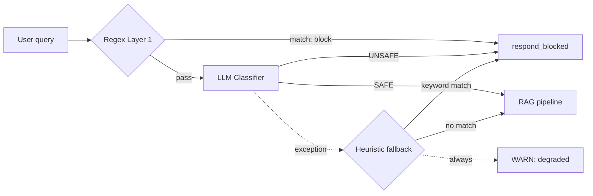

# Fail-closed turned an LLM-as-guardrail into a single point of failure

**TL;DR** — A banking RAG used a two-layer input guardrail: regex first, an LLM classifier second. When the LLM provider's quota ran out, the classifier raised exceptions and the guardrail did the textbook-correct thing — fail-closed, block everything. The result was that a single dependency failure (one GCP project's quota) silently turned the entire RAG into a "we cannot help you" message generator. We discovered it by accident, while pentesting *unrelated* vectors. The fix was not to make the LLM more reliable; it was to accept that a 100%-validating system that is 0%-available is worse, for this product, than a 99%-validating one that is 99%-available.

---

## Context

Banking RAG. FastAPI on GKE, LangGraph pipeline, retrieval over pgvector + BM25, generation by Gemini 2.5 Pro. Before any user query reaches retrieval, it passes through an input guardrail with two layers:

```
User query
   ↓
Layer 1 — regex patterns        (local, ~1 ms, free)
   - "ignore previous instructions"
   - JWT/Bearer tokens being smuggled in
   - role override patterns
   - ~30 patterns total
   ↓ pass
Layer 2 — LLM classifier        (Gemini Flash Lite, ~300 ms, ~$0.0001/call)
   - "Classify this query as SAFE or UNSAFE: <query>"
   - Catches paraphrases regex misses
   ↓ pass
RAG pipeline → response
```

The two layers are deliberate: regex is cheap and catches the obvious 95%; the LLM catches sophisticated paraphrases regex cannot. Both are required to pass.

The Layer 2 implementation, simplified:

```python
async def _classify_with_llm(self, query: str) -> GuardrailResult:
    try:
        response = await self.llm_client.generate(prompt_with(query))
        return self._parse_llm_response(response)
    except Exception:
        # Fail-closed: if Gemini misbehaves, block the request.
        logger.exception("LLM classifier failed, failing closed")
        return GuardrailResult(is_safe=False, ...)
```

Fail-closed is a defense-in-depth principle: if a security check fails, default to *deny*. It is the right rule for `IsAuthorized()`. It is repeated in OWASP, in NIST, in every security textbook.

---

## Attempt 1: trust the rule

We did not "attempt" a fix — this is the original code. Worth describing because the failure mode is not in the rule, it is in *applying it without thinking about availability*.

**Rule applied**: `except Exception: return UNSAFE`. Defensible. No hardcoded retries, no silent allow, no swallowed errors. By the book.

**What it actually means in production**: the guardrail's safety is now coupled to the *availability* of the LLM provider. Which is to say, coupled to a single GCP project's per-minute and per-day quota on Vertex AI Gemini. Which is to say, the entire RAG's availability is coupled to a quota counter we do not control directly.

This is fine in the happy path. We did not realize how brittle it was until it broke.

---

## How we found it

We were running an internal pentest (story 16) against the QA environment. Phase 4 was LLM adversarial — direct prompt injection, indirect injection, jailbreaks, encoding bypass, multi-turn manipulation. To explore how aggressive the guardrail was, we sent dozens of variant payloads in short succession, then sent dozens more.

After about an hour of probing, a thing started happening. Innocent control queries — `"How do I request vacation?"` — started returning the generic block message:

```
"I cannot process this query. Please rephrase your question
 about bank policies and procedures."
```

That is the "we blocked you" response. For *"How do I request vacation?"*. Something was wrong.

We checked the logs. Stack trace, repeating:

```
google.genai.errors.ClientError: 429 Too Many Requests.
{
  "error": {
    "code": 429,
    "message": "Resource exhausted. Please try again later.",
    "status": "RESOURCE_EXHAUSTED"
  }
}

src.shared.exceptions.ExternalServiceError: Gemini generation failed: 429

Input guardrail BLOCKED (llm): category=system_error,
   reason=Clasificador de seguridad temporalmente no disponible. Bloqueando por defecto.,
   query=How do I request vacation?
```

We had blown out the Gemini quota for the project — partly with the legitimate generation calls, partly with our own pentest probes against the LLM classifier. Once the quota was exhausted, every subsequent classification attempt threw a `ClientError`, which `_classify_with_llm` caught and dutifully translated into `is_safe=False`.

Every query. From every user. For as long as the quota stayed exhausted.

If a single attacker — or a single misbehaving admin user, or a single buggy frontend retry loop — could exhaust the quota, they could deny service to everyone. We accidentally did exactly that. We had not been targeting the guardrail; we hit it as collateral.

---

## The aha moment

The `except Exception: return UNSAFE` is a perfectly correct *security* decision and a perfectly bad *availability* decision. The cost of denying a query is not 0 — it is one user who cannot do their job — but the textbook treats security and availability as if they were ordered, security strictly first. They are not. They are two axes of a product, and a product that is 100% safe and 0% available is not safer in any meaningful sense; it is just dead.

The relevant question is not "is fail-closed right?" but **"what is this control protecting against, and what is the worst outcome on each side?"**:

- **Worst outcome of letting through a missed prompt injection during a quota outage**: the LLM produces a non-policy answer, which is then filtered by the *output* guardrail (a separate layer) and a citation-faithfulness check. The blast radius is bounded.
- **Worst outcome of fail-closing every query during a quota outage**: every legitimate user in the bank gets "I cannot help you", until someone notices and raises the quota, which can take minutes to hours.

Once framed that way, the answer changes. We are willing to trade a small increase in residual risk during outages for a large increase in availability. *For this product*. For a transactional banking system that moves money, the answer would be the opposite.

---

## The solution

Replace `fail-closed total` with `fail-closed targeted`. When the LLM fails, fall back to a small local heuristic that catches the *most blatant* prompt-injection attempts. If the heuristic is satisfied, allow the query through in *degraded mode* and emit a warning so monitoring can react.

```python
async def _classify_with_llm(self, query: str) -> GuardrailResult:
    try:
        response = await self.llm_client.generate(prompt_with(query))
        return self._parse_llm_response(response)
    except Exception:
        logger.exception("LLM classifier failed; falling back to heuristic")
        return self._classify_heuristic_fallback(query)

@staticmethod
def _classify_heuristic_fallback(query: str) -> GuardrailResult:
    suspicious = (
        "ignore previous", "ignore prior", "system prompt",
        "reveal your instructions", "act as dan", "do anything now",
        "jailbreak", "developer mode",
        # Spanish equivalents
        "ignorá las instrucciones", "olvidá las instrucciones",
        "mostrame el prompt", "revelá el prompt",
    )
    text = query.lower()
    for keyword in suspicious:
        if keyword in text:
            logger.warning("guardrail BLOCKED (heuristic fallback): keyword=%s", keyword)
            return GuardrailResult(is_safe=False, matched_rule="heuristic_fallback")

    logger.warning("guardrail DEGRADED: LLM unavailable, query passed heuristic")
    return GuardrailResult(is_safe=True, matched_rule="heuristic_fallback_degraded")
```

Three points worth pulling out:

1. **Layer 1 (regex) already ran before we got here.** The fallback only sees queries that already passed the cheap-but-narrow filter. The fallback is the last-line catch for things that escape regex *and* would only have been caught by the LLM.
2. **The `degraded` rule is loud on purpose.** Each fallback emits a `WARNING` log with a structured marker. A monitoring rule alerts the on-call when the rate of `degraded` exceeds 1% of traffic — which means the LLM has been unhealthy for non-trivial duration.
3. **We did not "lower" the guardrail.** The default path (LLM healthy) is unchanged. The change is what we do *during dependency failure*. The expected value of the system is unchanged in the happy path; in the unhappy path, it is strictly better.

This is part of a broader fix for OWASP **LLM10 — Unbounded Consumption**. The same audit produced two related findings: an admin role bypassing the per-endpoint rate limit on the chat path (so an admin could exhaust the quota by themselves), and a missing pre-validation of obviously expensive queries ("list 500 policies in detail"). Together those three bugs *form* the LLM10 chain. None of them is critical alone; their combination tips the system into the failure mode this story is about.

---

## Diagram



Before the fix, the dotted "exception" arrow led directly to `respond_blocked` for every query. After the fix, the heuristic decides per-query, and the alert path is always emitted so operators see it.

---

## Takeaways

1. **Fail-closed is correct as a default — but it is not a substitute for thinking about availability.** Every fail-closed branch is implicitly a coupling between your security posture and the availability of whatever you depend on for that branch.
2. **An LLM in the security-critical path is a dependency you do not control.** Treat its failure modes the way you would treat the failure modes of any external service: with timeouts, with retries where appropriate, with circuit breakers, and with a graceful-degradation plan that does not turn into a denial of service.
3. **Security and availability are two axes, not a strict order.** "100% security 0% availability" is not safer in any meaningful sense; it is just unusable. The right framing per control is "what does the worst outcome look like on each side?", and the answer depends on what the product does. A RAG over policy documents is not a wire transfer system.
4. **The cheap, narrow first layer pays off precisely in the failure of the deeper layer.** Regex Layer 1 was carrying all the load during the outage, and it was good enough — because *most* prompt-injection attempts are blunt. The sophisticated ones are rare.
5. **A degraded mode is only a degraded mode if it is observable.** The `WARN: degraded` log + a monitoring rule is what turns the fallback from "silently accepting risk" into "explicitly accepting risk and alerting humans".

---

## Stack involved

- Gemini 2.5 Pro for generation, Gemini Flash Lite for the input classifier (Vertex AI).
- LangGraph for the RAG pipeline composition.
- FastAPI + asyncio.
- structlog for the `degraded` warnings; Langfuse for in-trace metadata.
- The same project's billing/quota dashboard, which is what eventually told us the quota was exhausted (we had to look — the API error was the trigger, but the quota dashboard was the confirmation).

---

## Links / references

- [OWASP LLM10:2025 — Unbounded Consumption](https://genai.owasp.org/llmrisk/llm10-unbounded-consumption/)
- [Vertex AI 429 Resource Exhausted](https://cloud.google.com/vertex-ai/generative-ai/docs/error-code-429)
- Story 16 — *Pentesting your own banking RAG before the bank does* (the pentest that surfaced this by accident)
- Story 22 — *The four security controls that passed code review and never ran* (the broader pattern this finding fits into)
