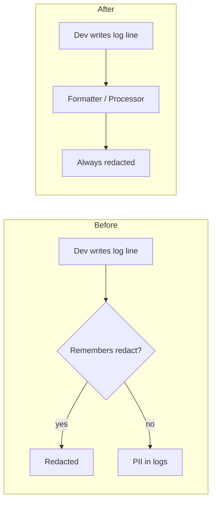

# The redaction that wasn't there enough

**TL;DR** — A banking RAG had a clean PII redactor function and the team had called it in every log they wrote that touched the user query. SAST liked it, code review approved it, unit tests covered it. After deploy I re-ran the pentest PoC against the cluster and found two more log sites that nobody had touched — the function was perfect; the human discipline was not. The fix was not "find the missing call sites and add them" — it was to move the guarantee out of the human's hands entirely, into a logging formatter and a structlog processor that redact every log message regardless of who wrote it or what fields it uses.

---

## Context

Banking RAG over policy documents, regulated environment. Pydantic API, FastAPI handlers, LangGraph nodes, structlog and stdlib `logging` mixed (about 95% stdlib, 5% structlog — typical for an app that grew organically).

PII finding from the pentest: a user query containing a national ID number (DNI) was being persisted in plaintext in three places:

1. The `messages.content` column of the conversations table.
2. structlog and stdlib `logging` output (which ships to Cloud Logging).
3. Langfuse traces (the `@observe` decorator captures function inputs).

Regulatory exposure: local data protection law plus the central-bank cyber-risk regulation both treat plaintext PII in operational logs as a finding. The bank's external pentest team will check for this.

We had a clean utility:

```python
# src/shared/pii_redactor.py
def redact_pii(text: str) -> str:
    for pattern, replacement in _PII_PATTERNS:
        text = pattern.sub(replacement, text)
    return text
```

Patterns covered the locally-relevant set (national ID, tax ID, bank account number, credit cards, email, phone numbers). The function is short, well-tested, idempotent. Nothing wrong with it.

---

## Attempt 1: call `redact_pii()` everywhere it's needed

This is what the team did initially. Find each `logger.info(...)` that included the user query, wrap the query in `redact_pii(...)`, ship. Three sites identified:

```python
# src/infrastructure/security/guardrails/input_validator.py
logger.warning(
    "Input guardrail BLOCKED (pattern): rule=%s, query=%.100s",
    rule_name, redact_pii(query),   # ← added
)

# src/application/graphs/nodes/validate_input.py — two sites, same pattern
```

Plus the persistence path:

```python
# src/application/use_cases/rag/stream_response.py
user_msg = Message(
    conversation_id=conversation_id,
    role="user",
    content=redact_pii(message),   # ← added
)
```

And the Langfuse client was already importing `redact_pii` — the trace serializer applied it to `event_dict` values, so the third channel was covered.

Unit tests passed. The PoC of the finding — a query with a synthetic ID canary — was retested locally with mocks: the DB call recorded the redacted form, the captured logs showed the redacted form, the Langfuse trace serializer applied the redaction. Clean. Merged. Deployed.

**Result locally**: green. **Result in DEV runtime, retest against the actual cluster**: not green.

---

## The aha moment

I sent the same canary query through the deployed system and dumped the API pod's logs. The redaction in `input_validator` was there. The redaction in `validate_input` was there. The DB column had the redacted form. But:

```
retrieve: 12 chunks para la query 'Soy el cliente con DNI <NNNNNNNN>
CUIT <NN-NNNNNNNN-N> PII-CANARY-RETEST. Cómo solicito licencia?' (...)
```

The retrieve node was emitting the unredacted query in its info log. It was a log site we had not touched — the team had genuinely missed it because nobody was thinking about that node when they grep'd for "where do we log the query?". And tucked deeper in the same file was a second site, in a `try/except` over a query reformulation:

```python
logger.exception("retrieve: hybrid_search failed for reformulation=%r", q[:80])
```

Then `rewrite_query.py` had a third one I hadn't noticed:

```python
logger.info("rewrite_query: '%s' → '%s'", query, rewritten)
```

Five sites total. We had found three. The other two were waiting for someone to write a query with PII and notice.

This is the part that bothered me. The five sites were not exotic — they were perfectly ordinary `logger.info("...", query)` calls written by reasonable people. The reason we missed two was not negligence; it was that **the approach itself does not scale**. Every time someone adds a new log line that touches the query (a new node, a new debug print, a new structured event), they have to *know* about the PII redaction policy and remember to apply it. That is a memorization problem masquerading as a code problem.

> If correctness depends on every contributor remembering a hidden rule, the rule is going to be forgotten. Not "if it might be forgotten" — *will*. The only question is how many releases until it ships.

The fix was not to find the two missing sites and add `redact_pii(query)` to them. We could do that and the test would go green. But the next time someone added a sixth log site, we would be back here. The fix was to make the manual call site unnecessary.

---

## Attempt 2: move the guarantee out of the dev's hands

Two log pipelines coexist in the codebase. They need different treatments.

### For stdlib `logging` — a formatter that redacts the final string

```python
# src/infrastructure/observability/pii_log_filter.py
class PIIRedactingFormatter(logging.Formatter):
    def format(self, record: logging.LogRecord) -> str:
        formatted = super().format(record)
        try:
            return redact_pii(formatted)
        except Exception:
            # Defense in depth: never break the logging pipeline.
            return formatted + " [PII_REDACTOR_ERROR]"
```

The key choice is *where* the redaction runs. It runs on the **fully formatted string**, after argument substitution. So a developer can write `logger.info("query: %s", user_input)` — there is no field to remember to redact, no helper to call. The substitution happens, then the formatter sees the resulting string, then `redact_pii()` runs on it. Imposs ible to skip without removing the formatter.

### For structlog — a processor at the end of the chain

```python
def pii_redacting_processor(_logger, _method_name, event_dict):
    try:
        for key, value in list(event_dict.items()):
            if isinstance(value, str):
                event_dict[key] = redact_pii(value)
    except Exception:
        event_dict["_pii_redactor_error"] = True
    return event_dict
```

Same idea, different pipeline. The processor is registered as the **last** in the chain before the renderer, so it sees everything that any other processor has added.

Both pipelines fail-safe: if `redact_pii()` raises (regex pathological input, library bug, whatever), the log line still emits. We prefer a slightly noisy log over a missing one. A missing log is worse than a log with `[PII_REDACTOR_ERROR]` — the noisy version at least surfaces the failure to whoever reads it.

### Wiring it in once

In `logging_config.py`:

```python
def configure_logging():
    shared_processors = [
        # ...
        pii_redacting_processor,   # last before renderer
    ]
    structlog.configure(processors=[*shared_processors, JSONRenderer()])

    logging.basicConfig(format="%(message)s", level=log_level, force=True)
    pii_formatter = PIIRedactingFormatter("%(message)s")
    for handler in logging.getLogger().handlers:
        handler.setFormatter(pii_formatter)
```

That's it. One configuration step at app startup, and every log line written anywhere in the codebase — by us, by the team, by a future contributor who never heard of the pentest finding — is redacted at emission.

The critical test was the one I should have written from the start:

```python
def test_dev_writing_new_log_line_is_covered():
    """Simulates a future developer writing a new logger.info() with PII,
    without knowing about the redaction policy. Should still be redacted."""
    logger, buf = self._make_logger()

    user_query = "Soy DNI <NNNNNNNN> y mi CUIT es <NN-NNNNNNNN-N>"
    logger.info("DEBUG: query received: %s", user_query)
    logger.warning("processing query: %r", user_query)
    logger.error("failed for input %s", user_query)

    out = buf.getvalue()
    assert "[DNI REDACTED]" in out
    assert "[CUIT REDACTED]" in out
```

This test is the contract: **adding a new log line should not require knowing about PII**. If it passes today and someone removes the formatter tomorrow, the test catches it. The guarantee is now a property of the system, not of the developer.

---

## Why the manual approach is broken by design

Two reasons, both structural:

1. **Logging is the universal escape hatch.** Anywhere in a codebase, a developer can write `logger.info(...)`. There is no type system, no compiler, no review gate that knows what "PII" means. So any rule of the form "every log that touches user input must call X" is a rule the developer has to *remember*. The set of "places this rule applies" is unbounded — it grows with every new feature, every new node, every debug session.

2. **The bug is invisible until exercised.** Unlike a syntax error, a missing `redact_pii()` call does not break anything. The log just emits with PII in it. The test passes. The code review passes. The pentest catches it months later — if you are lucky enough to have a pentest. In production, it just sits there.

These two together mean: a manual approach that requires per-call-site discipline will *eventually* leak. The leak is delayed but inevitable. The reasonable thing is to assume the leak and move the control to a layer where the developer cannot opt out.

This is the same instinct that drives "secure by default" config, "deny by default" firewalls, and ORM-parameterized queries instead of "remember to sanitize". The pattern is older than logging — we just had to remember it applied here too.

---

## Diagram



---

## Takeaways

1. **If correctness depends on every contributor remembering a rule, the rule will be broken.** Not might — *will*. Move the guarantee to a layer where forgetting is impossible.
2. **Test for the future contributor, not just the current one.** A test that simulates "someone writing a new log line without knowing about the policy" is the one that proves the fix is structural. If you cannot write that test, your fix is a patch.
3. **Don't redact field by field — redact the final output.** Working on the formatted string (stdlib) or the post-processed event_dict (structlog) is robust against schema changes. Working on specific named fields breaks the day someone names a field `data` instead of `query`.
4. **Fail safe, not closed.** If your redactor crashes, do not lose the log line. Emit it with a marker and move on. A logging pipeline that goes down is a worse problem than a log with one suspicious field.
5. **The re-test against the deployed system is not optional.** The lab test with mocks proved that the function I added worked. The retest against the real cluster proved that the function I added was not enough. They are different questions. Both have to pass.

---

## Stack involved

- Python `logging` (stdlib) + structlog.
- Pydantic v2 for app models.
- FastAPI, LangGraph for the RAG pipeline.
- A `redact_pii()` regex utility specific to the locally regulated PII set (national ID, tax ID, bank account, cards, email, phone).

---

## Links / references

- Story 22 — *The four security controls that passed code review and never ran* (the structural failure mode this story is a variation of).
- [structlog processor chain](https://www.structlog.org/en/stable/processors.html).
- [Python logging Formatter](https://docs.python.org/3/library/logging.html#logging.Formatter).
